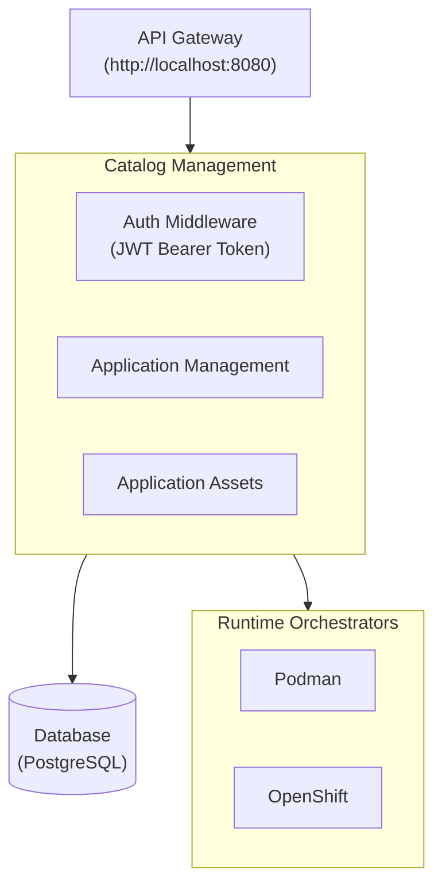

# Application Deployment API Proposal

**Version:** 2.0
**Date:** June 2026
**Status:** Implemented

## Table of Contents

1. [Executive Summary](#1-executive-summary)
2. [Background and Motivation](#2-background-and-motivation)
   - 2.1 [Current State](#21-current-state)
   - 2.2 [Problem Statement](#22-problem-statement)
   - 2.3 [Goals](#23-goals)
3. [Architecture Overview](#3-architecture-overview)
   - 3.1 [Key Concepts](#31-key-concepts)
   - 3.2 [System Components](#32-system-components)
4. [API Specification](#4-api-specification)
   - 4.1 [Base URL](#41-base-url)
   - 4.2 [Authentication](#42-authentication)
   - 4.3 [Endpoint Categories](#43-endpoint-categories)
5. [API Endpoint Details](#5-api-endpoint-details)
   - 5.1 [Authentication Endpoints](#51-authentication-endpoints)
     - 5.1.1 [Login](#511-login)
     - 5.1.2 [Refresh Token](#512-refresh-token)
     - 5.1.3 [Logout](#513-logout)
     - 5.1.4 [Get Current User](#514-get-current-user)
   - 5.2 [Application Management Endpoints](#52-application-management-endpoints)
     - 5.2.1 [List Applications](#521-list-applications)
     - 5.2.2 [Get Application Details](#522-get-application-details)
     - 5.2.3 [Create Application](#523-create-application)
     - 5.2.4 [Update Application](#524-update-application)
     - 5.2.5 [Delete Application](#525-delete-application)
     - 5.2.6 [Get Pod/Container Health Status](#526-get-podcontainer-health-status)
     - 5.2.7 [Get Application Resources](#527-get-application-resources)
   - 5.3 [Catalog Endpoints](#53-catalog-endpoints)
     - 5.3.1 [List Available Architectures](#531-list-available-architectures)
     - 5.3.2 [Get Architecture Details](#532-get-architecture-details)
     - 5.3.3 [List Available Services](#533-list-available-services)
     - 5.3.4 [Get Service Details](#534-get-service-details)
   - 5.4 [Deploy Options Endpoints](#54-deploy-options-endpoints)
     - 5.4.1 [Get Architecture Deploy Options](#541-get-architecture-deploy-options)
     - 5.4.2 [Get Service Deploy Options](#542-get-service-deploy-options)
     - 5.4.3 [Get Component Provider Parameters](#543-get-component-provider-parameters)
     - 5.4.4 [Get Service Parameters](#544-get-service-parameters)
6. [Error Handling](#6-error-handling)
   - 6.1 [Error Response Format](#61-error-response-format)
   - 6.2 [HTTP Status Codes](#62-http-status-codes)

## 1. Executive Summary

This proposal outlines the design and implementation of a comprehensive REST API for managing application deployments in the AI Services Catalog. The API will enable users to deploy, monitor, and manage AI service applications through a unified interface, supporting both individual services and complete architectures across multiple runtime environments (Podman and OpenShift).

## 2. Background and Motivation

### 2.1 Current State

The AI Services Catalog currently provides various AI services (chat, summarization, digitization) that can be deployed independently. However, there is no unified API for managing these deployments programmatically.

### 2.2 Problem Statement

Users need a standardized way to:

- Deploy services individually or as complete architectures
- Monitor deployment status and health
- Manage service configurations
- Access service endpoints
- Handle authentication and authorization

### 2.3 Goals

1. Provide a RESTful API for application lifecycle management
2. Support both architecture-level (multiple services) and service-level deployments
3. Enable multi-runtime support (Podman and OpenShift)
4. Implement secure authentication and authorization

## 3. Architecture Overview

### 3.1 Key Concepts

**Architecture**: A collection of multiple services that work together as a cohesive application (e.g., Digital Assistant).

**Service**: An individual AI service that can be deployed standalone (e.g., summarization service, chat service).

**Runtime**: The deployment environment (Podman, OpenShift).

### 3.2 Backend System Components



## 4. API Specification

### 4.1 Base URL

```
http://localhost:8080/api/v1
```

### 4.2 Authentication

All endpoints (except `/auth/login` and `/auth/refresh`) require JWT Bearer token authentication:

```
Authorization: Bearer <access_token>
```

**Token Lifecycle:**

- Access tokens expire after 15 minutes
- Refresh tokens valid for 7 days
- Token blacklisting on logout

### 4.3 Endpoint Categories

#### Authentication Endpoints

- `POST /api/v1/auth/login` - User login
- `POST /api/v1/auth/refresh` - Refresh access token
- `POST /api/v1/auth/logout` - User logout
- `GET /api/v1/auth/me` - Get current user info

#### Application Management Endpoints

- `GET /api/v1/applications/` - List all deployments
- `GET /api/v1/applications/{id}` - Get deployment details
- `POST /api/v1/applications/` - Create new deployment
- `PUT /api/v1/applications/{id}` - Update deployment
- `DELETE /api/v1/applications/{id}` - Delete deployment
- `GET /api/v1/applications/{id}/ps` - Get pod/container health status
- `GET /api/v1/applications/{id}/resources` - Get application resource usage

#### Catalog Endpoints

- `GET /api/v1/architectures` - List available architectures
- `GET /api/v1/architectures/{id}` - Get architecture details
- `GET /api/v1/architectures/{id}/deploy-options` - Get architecture deploy options

- `GET /api/v1/services` - List available services
- `GET /api/v1/services/{id}` - Get service details
- `GET /api/v1/services/{id}/deploy-options` - Get service deploy options
- `GET /api/v1/services/{id}/params` - Get service parameters

- `GET /api/v1/components/{component_type}/providers/{provider_id}/params` - Get component provider params

## 5. API Endpoint Details

This section provides detailed specifications for each API endpoint, including request/response schemas and implementation notes.

### 5.1 Authentication Endpoints

#### 5.1.1 Login

**Endpoint:** `POST /api/v1/auth/login`

**Description:** Authenticates a user and returns JWT tokens for subsequent API calls.

**Request Headers:**

```
Content-Type: application/json
```

**Request Body:**

```json
{
  "username": "admin",
  "password": "password"
}
```

**Request Schema:**
| Field | Type | Required | Description |
|-------|------|----------|-------------|
| username | string | Yes | User's username |
| password | string | Yes | User's password |

**Response (200 OK):**

```json
{
  "access_token": "eyJhbGc...",
  "refresh_token": "eyJhbGc...",
  "token_type": "Bearer"
}
```

**Response Schema:**
| Field | Type | Description |
|-------|------|-------------|
| access_token | string | JWT access token for API authentication |
| refresh_token | string | JWT refresh token for obtaining new access tokens |
| token_type | string | Token type (always "Bearer") |

**Error Responses:**

- `401 Unauthorized` - Invalid credentials
- `400 Bad Request` - Missing or invalid request body

**Implementation Notes:**

1. **Request Validation**: Use Gin's `ShouldBindJSON` to validate request body against `loginReq` struct (username, password required)
2. **User Lookup**: Call `UserRepository.GetByUserName(ctx, username)` to retrieve user from in-memory store
3. **Password Verification**: Use PBKDF2 with SHA256 to verify password against stored hash
   - Hash format: `iterations.salt.hash` (base64 encoded)
   - Uses constant-time comparison (`subtle.ConstantTimeCompare`) to prevent timing attacks
4. **Token Generation**:
   - Generate JWT access token with `TokenManager.GenerateAccessToken(userID)`
   - Generate JWT refresh token with `TokenManager.GenerateRefreshToken(userID)`
   - Both tokens include custom claims: `uid` (user ID), issuer ("ai-services-catalog-server"), subject, audience, expiry
   - Access token audience: "access", Refresh token audience: "refresh"
   - Signing method: HS256 with secret key
5. **Response**: Return both tokens with "Bearer" token type (handler returns access_token, refresh_token, token_type)
6. **Error Handling**: Return 401 for invalid credentials, 400 for malformed requests, 500 for database errors

**Security Considerations:**

- Passwords stored as PBKDF2 hashes (iterations + salt + hash, not plaintext)
- JWT tokens signed with HS256 and secret key
- Token audience field prevents token type confusion attacks
- Constant-time password comparison prevents timing attacks
- Access tokens expire after configured TTL (default: 15 minutes)
- Refresh tokens valid for configured TTL (default: 7 days)

---

#### 5.1.2 Refresh Token

**Endpoint:** `POST /api/v1/auth/refresh`

**Description:** Obtains a new access token using a valid refresh token.

**Request Headers:**

```
Content-Type: application/json
```

**Request Body:**

```json
{
  "refresh_token": "eyJhbGc..."
}
```

**Request Schema:**
| Field | Type | Required | Description |
|-------|------|----------|-------------|
| refresh_token | string | Yes | Valid refresh token from login |

**Response (200 OK):**

```json
{
  "access_token": "eyJhbGc...",
  "refresh_token": "eyJhbGc...",
  "token_type": "Bearer"
}
```

**Response Schema:**
| Field | Type | Description |
|-------|------|-------------|
| access_token | string | New JWT access token |
| refresh_token | string | New JWT refresh token |
| token_type | string | Token type (always "Bearer") |

**Error Responses:**

- `401 Unauthorized` - Invalid or expired refresh token
- `400 Bad Request` - Missing refresh token

**Implementation Notes:**

1. **Request Validation**: Use Gin's `ShouldBind` to validate request body against `refreshReq` struct (refresh_token required)
2. **Verify Refresh Token Signature**: Call `TokenManager.ValidateRefreshToken(refreshToken)` to:
   - Parse JWT token with HS256 signature verification
   - Validate token expiry and claims
   - Check audience field is "refresh" (prevents access token misuse)
   - Extract user ID and expiry time from custom claims
   - Return 401 if signature is invalid or token is expired
3. **Check Token Blacklist**: Hash the refresh token and verify it's NOT blacklisted:
   - Call `TokenStore.Contains(HashToken(refreshToken), "refresh")`
   - Return 401 "token has been revoked" if found in blacklist
4. **Token Rotation**: Generate new token pair:
   - New access token with `TokenManager.GenerateAccessToken(userID)`
   - New refresh token with `TokenManager.GenerateRefreshToken(userID)`
   - Both tokens have fresh expiry times
5. **Blacklist Old Refresh Token**: Add the old refresh token to blacklist:
   - Hash the old refresh token: `oldTokenHash := HashToken(refreshToken)`
   - Call `TokenStore.Add(oldTokenHash, "refresh", refreshTokenExpiry)`
   - Inserts into `tokens_blacklist` table with token_type='refresh'
6. **Response**: Return new access_token, refresh_token, and token_type
7. **Error Handling**: Return 401 for invalid/expired/revoked tokens, 400 for missing or invalid request body, 500 for database errors

**Security Considerations:**

- Refresh tokens are rotated on each use (new tokens generated)
- Old refresh token is blacklisted after successful refresh to prevent reuse
- Token audience validation prevents token type confusion
- Both access and refresh tokens are blacklisted in the same `tokens_blacklist` table with `token_type` field

---

#### 5.1.3 Logout

**Endpoint:** `POST /api/v1/auth/logout`

**Description:** Invalidates the current access token and optionally invalidates the provided refresh token.

**Request Headers:**

```
Authorization: Bearer <access_token>
X-Refresh-Token: <refresh_token>   (optional)
```

**Request Body:** None

**Response (200 OK):**

```json
{
  "message": "logged out"
}
```

**Response Schema:**
| Field | Type | Description |
|-------|------|-------------|
| message | string | Success message ("logged out") |

**Error Responses:**

- `400 Bad Request` - Missing access token in context
- `401 Unauthorized` - Invalid or missing access token
- `500 Internal Server Error` - Failed to logout

**Implementation Notes:**

1. **Access Token Extraction**: Retrieve raw access token from Gin context using `middleware.CtxRawTokenKey`
   - Token was previously extracted and validated by `AuthMiddleware`
   - Return 400 if access token is missing from context
2. **Refresh Token Extraction**: Retrieve refresh token from `X-Refresh-Token` header
   - The `X-Refresh-Token` header is **optional** — if not provided, only the access token is blacklisted
3. **Blacklist Access Token**: Hash and store access token in database:
   - Call `TokenStore.Add(HashToken(accessToken), "access", accessTokenExpiry)`
   - Inserts into `tokens_blacklist` table with token_type='access'
   - Use ON CONFLICT DO NOTHING to handle duplicate logout attempts
5. **Blacklist Refresh Token** (if provided): Hash and store refresh token in database:
   - Call `TokenStore.Add(HashToken(refreshToken), "refresh", refreshTokenExpiry)`
   - Inserts into `tokens_blacklist` table with token_type='refresh'
   - Use ON CONFLICT DO NOTHING to handle duplicate logout attempts
6. **Response**: Return success message "logged out"
7. **Error Handling**: Return 400 for missing access token, 500 for database failures

**Token Storage Implementation:**

- Uses PostgreSQL `tokens_blacklist` table with columns: id, token_hash, token_type, expires_at
- Tokens are hashed using SHA-256 before storage (64-character hex string)
- Blacklist approach for both token types:
  - Access tokens: Blacklisted on logout (token_type='access')
  - Refresh tokens: Blacklisted on logout or refresh (token_type='refresh')
- Token type is stored as PostgreSQL ENUM with values: 'access', 'refresh'
- Periodic cleanup job removes expired tokens: `DELETE FROM tokens_blacklist WHERE expires_at < NOW()`
- Database-backed implementation supports multi-instance deployments
- Server does NOT store plaintext tokens - only SHA-256 hashes

**Middleware Integration:**

- `AuthMiddleware` checks access token against blacklist:
  - Hash the token: `tokenHash := HashToken(accessToken)`
  - Query: `SELECT EXISTS(SELECT 1 FROM tokens_blacklist WHERE token_hash = $1 AND token_type = 'access' AND expires_at > NOW())`
  - Returns 401 "token revoked" if blacklisted
- `RefreshTokens` endpoint checks refresh token against blacklist:
  - Hash the token: `tokenHash := HashToken(refreshToken)`
  - Query: `SELECT EXISTS(SELECT 1 FROM tokens_blacklist WHERE token_hash = $1 AND token_type = 'refresh' AND expires_at > NOW())`
  - Returns 401 "token has been revoked" if blacklisted
- Ensures revoked tokens cannot be used even if still valid

**Token Hashing:**

Tokens use SHA-256 for hashing (not PBKDF2 like passwords) because:
- JWTs are already cryptographically secure and signed
- We only need fast lookup, not brute-force protection

```go
import (
    "crypto/sha256"
    "encoding/hex"
)

func HashToken(token string) string {
    hash := sha256.Sum256([]byte(token))
    return hex.EncodeToString(hash[:])
}
```

**Note**: Passwords use PBKDF2 with SHA-256 (slow, with salt and iterations) for brute-force protection, while tokens use simple SHA-256 (fast) for lookup since JWTs are already secure.

---

#### 5.1.4 Get Current User

**Endpoint:** `GET /api/v1/auth/me`

**Description:** Returns information about the currently authenticated user.

**Request Headers:**

```
Authorization: Bearer <access_token>
```

**Request Body:** None

**Response (200 OK):**

```json
{
  "id": "uid_1",
  "username": "admin",
  "name": "Administrator"
}
```

**Response Schema:**
| Field | Type | Description |
|-------|------|-------------|
| id | string | Unique user identifier |
| username | string | User's username |
| name | string | User's display name |

**Error Responses:**

- `401 Unauthorized` - Invalid or missing access token

**Implementation Notes:**

1. **User ID Extraction**: Retrieve user ID from Gin context using `middleware.CtxUserIDKey`
   - User ID was extracted from JWT token by `AuthMiddleware` during authentication
2. **User Lookup**: Call `AuthService.GetUser(ctx, userID)` which:
   - Calls `UserRepository.GetByID(ctx, userID)` to fetch user from in-memory store
   - Returns `models.User` struct with ID, UserName, PasswordHash, Name
3. **Response Filtering**: Return only safe fields (id, username, name)
   - **Do not expose**: PasswordHash or other sensitive information
4. **Error Handling**: Return 401 for missing user ID, 404 for user not found

**Middleware Flow:**

- `AuthMiddleware` validates Bearer token from Authorization header
- Extracts user ID from JWT custom claims (`uid` field)
- Sets user ID in Gin context with key `middleware.CtxUserIDKey`
- Sets raw token in context with key `middleware.CtxRawTokenKey`
- Adds `X-Token-Exp` header with token expiry time (UTC format)

**Repository:**

- Uses `InMemoryUserRepo` with dual-index maps (by ID and by username)
- Thread-safe with RWMutex for concurrent access
- Returns `ErrUserNotFound` if user doesn't exist

---

### 5.2 Application Management Endpoints

#### 5.2.1 List Applications

**Endpoint:** `GET /api/v1/applications/`

**Description:** Retrieves a paginated list of all applications for the authenticated user.

**Request Headers:**

```
Authorization: Bearer <access_token>
```

**Query Parameters:**
| Parameter | Type | Required | Default | Description |
|-----------|------|----------|---------|-------------|
| page | integer | No | 1 | Page number (1-indexed) |
| page_size | integer | No | 20 | Number of items per page (max: 100) |
| deployment_type | string | No | - | Filter by deployment type: "architectures" or "services" |
| catalog_id | string | No | - | Filter by catalog ID (e.g., "rag", "chat", "digitize", "summarize") |

**Request Body:** None

**Response (200 OK):**

```json
{
  "data": [
    {
      "id": "6bc66d76-65eb-46d5-aeb7-7914033dc869",
      "name": "Digital assistant (copy)",
      "catalog_id": "rag",
      "deployment_type": "architectures",
      "type": "Digital Assistant",
      "status": "Running",
      "message": "Deployment completed successfully",
      "version": "v0.0.1",
      "services": [
        {
          "id": "b970e387-d3e3-4cbc-8495-e30431de953f",
          "type": "Digitize documents",
          "status": "Running",
          "message": "Service deployed successfully"
        },
        {
          "id": "2bacec3f-6109-4e47-afd9-8161f4c88746",
          "type": "Find similar items",
          "status": "Running",
          "message": "Service deployed successfully"
        },
        {
          "id": "2fc7a858-5b85-4b4a-9ee6-aa2b4e1cd7a6",
          "type": "Summarize",
          "status": "Running",
          "message": "Service deployed successfully"
        },
        {
          "id": "9229e7a5-5e17-4208-8e01-19ccbe649c1d",
          "type": "Question and answer",
          "status": "Running",
          "message": "Service deployed successfully"
        }
      ],
      "created_at": "2026-06-30T15:15:06Z",
      "updated_at": "2026-06-30T15:21:56Z"
    }
  ],
  "pagination": {
    "page": 1,
    "page_size": 20,
    "total_items": 1,
    "total_pages": 1,
    "has_next": false,
    "has_prev": false
  }
}
```

**Response Schema:**

**Root Object:**
| Field | Type | Description |
|-------|------|-------------|
| data | array | Array of application objects |
| pagination | object | Pagination metadata |

**Application Object (data[]):**
| Field | Type | Description |
|-------|------|-------------|
| id | string | Application ID (UUID) |
| name | string | Application name |
| catalog_id | string | Catalog ID used to create this application (e.g., "rag") |
| deployment_type | string | Type of deployment: "architectures" or "services" |
| type | string | Application type display name (e.g., "Digital Assistant", "Summary") |
| status | string | Current status: "Downloading", "Deploying", "Running", "Deleting", "Error" |
| message | string | Status message or error details |
| version | string | Application version |
| services | array | Array of service summary objects (omitted if empty) |
| created_at | string | ISO 8601 timestamp of creation |
| updated_at | string | ISO 8601 timestamp of last update |

**Service Summary Object (services[]) — list view:**
| Field | Type | Description |
|-------|------|-------------|
| id | string | Service ID (UUID) |
| type | string | Service type display name (e.g., "Digitize documents", "Question and answer") |
| status | string | Service status |
| message | string | Status message |

**Pagination Object:**
| Field | Type | Description |
|-------|------|-------------|
| page | integer | Current page number (1-indexed) |
| page_size | integer | Number of items per page |
| total_items | integer | Total number of applications matching filters |
| total_pages | integer | Total number of pages |
| has_next | boolean | Whether there is a next page |
| has_prev | boolean | Whether there is a previous page |

**Error Responses:**

- `400 Bad Request` - Invalid query parameters (e.g., page < 1, page_size > 100, invalid deployment_type)
- `401 Unauthorized` - Invalid or missing access token
- `500 Internal Server Error` - Server error

**Implementation Notes:**

1. Validate JWT token from Authorization header via `AuthMiddleware`
2. Validate pagination parameters (page >= 1, page_size between 1-100)
3. Validate `deployment_type` — must be `"architectures"` or `"services"` if provided
4. Query applications table with pagination and filters
5. Construct paginated response with application data and metadata

**Example Requests:**

```
# Get first page with default settings
GET /api/v1/applications/

# Get second page with 50 items per page
GET /api/v1/applications/?page=2&page_size=50

# Filter by deployment type (architectures only)
GET /api/v1/applications/?deployment_type=architectures

# Filter by catalog ID
GET /api/v1/applications/?catalog_id=rag

# Combine filters
GET /api/v1/applications/?deployment_type=architectures&catalog_id=rag&page=1&page_size=10
```

---

#### 5.2.2 Get Application Details

**Endpoint:** `GET /api/v1/applications/{id}`

**Description:** Retrieves detailed information about a specific application.

**Request Headers:**

```
Authorization: Bearer <access_token>
```

**Path Parameters:**
| Parameter | Type | Required | Description |
|-----------|------|----------|-------------|
| id | string | Yes | Application ID (UUID) |

**Request Body:** None

**Response (200 OK) — Architecture Deployment:**

```json
{
  "id": "6bc66d76-65eb-46d5-aeb7-7914033dc869",
  "name": "Digital assistant (copy)",
  "catalog_id": "rag",
  "deployment_type": "architectures",
  "type": "Digital Assistant",
  "status": "Running",
  "message": "Deployment completed successfully",
  "version": "1.0.0",
  "created_at": "2026-06-30T15:15:06Z",
  "updated_at": "2026-06-30T15:21:56Z",
  "services": [
    {
      "id": "b970e387-d3e3-4cbc-8495-e30431de953f",
      "type": "Digitize documents",
      "catalog_id": "digitize",
      "status": "Running",
      "message": "",
      "version": "1.0.0",
      "endpoints": [
        { "type": "ui",  "url": "https://digitize-ui-74a76872bd.10.20.185.165.nip.io" },
        { "type": "api", "url": "https://digitize-backend-74a76872bd.10.20.185.165.nip.io" }
      ],
      "components": [
        {
          "id": "40667240-8af2-413f-b6b2-0be8ebc88d63",
          "type": "vector_store",
          "provider": { "id": "opensearch", "name": "OpenSearch" },
          "status": "Running",
          "message": "Component deployed successfully"
        },
        {
          "id": "fbc9862c-045e-4d0a-bbb6-b9e290f7acb8",
          "type": "embedding",
          "provider": { "id": "vllm-cpu", "name": "AI Inference on CPU" },
          "status": "Running",
          "message": "Component deployed successfully",
          "metadata": { "model": "ibm-granite/granite-embedding-278m-multilingual" }
        },
        {
          "id": "fc01cd00-9f97-4086-8946-eca13a1c96a1",
          "type": "llm",
          "provider": { "id": "vllm-cpu", "name": "AI Inference on CPU" },
          "status": "Running",
          "message": "Component deployed successfully",
          "metadata": { "model": "ibm-granite/granite-3.3-8b-instruct" }
        }
      ],
      "created_at": "2026-06-30T15:15:06Z",
      "updated_at": "2026-06-30T15:21:54Z"
    },
    {
      "id": "9229e7a5-5e17-4208-8e01-19ccbe649c1d",
      "type": "Question and answer",
      "catalog_id": "chat",
      "status": "Running",
      "message": "",
      "version": "1.0.0",
      "endpoints": [
        { "type": "ui",  "url": "https://chat-bot-ui-74a76872bd.10.20.185.165.nip.io" },
        { "type": "api", "url": "https://chat-bot-backend-74a76872bd.10.20.185.165.nip.io" }
      ],
      "components": [
        {
          "id": "40667240-8af2-413f-b6b2-0be8ebc88d63",
          "type": "vector_store",
          "provider": { "id": "opensearch", "name": "OpenSearch" },
          "status": "Running",
          "message": "Component deployed successfully"
        },
        {
          "id": "fbc9862c-045e-4d0a-bbb6-b9e290f7acb8",
          "type": "embedding",
          "provider": { "id": "vllm-cpu", "name": "AI Inference on CPU" },
          "status": "Running",
          "message": "Component deployed successfully",
          "metadata": { "model": "ibm-granite/granite-embedding-278m-multilingual" }
        },
        {
          "id": "fc01cd00-9f97-4086-8946-eca13a1c96a1",
          "type": "llm",
          "provider": { "id": "vllm-cpu", "name": "AI Inference on CPU" },
          "status": "Running",
          "message": "Component deployed successfully",
          "metadata": { "model": "ibm-granite/granite-3.3-8b-instruct" }
        }
      ],
      "created_at": "2026-06-30T15:15:06Z",
      "updated_at": "2026-06-30T15:21:52Z"
    }
  ]
}
```

**Response (200 OK) — Service Deployment:**

```json
{
  "id": "2fc7a858-5b85-4b4a-9ee6-aa2b4e1cd7a6",
  "name": "Summarize",
  "catalog_id": "summarize",
  "deployment_type": "services",
  "type": "Summarize",
  "status": "Running",
  "message": "Deployment completed successfully",
  "version": "1.0.0",
  "created_at": "2026-06-30T15:15:06Z",
  "updated_at": "2026-06-30T15:21:56Z",
  "services": [
    {
      "id": "2fc7a858-5b85-4b4a-9ee6-aa2b4e1cd7a6",
      "type": "Summarize",
      "catalog_id": "summarize",
      "status": "Running",
      "message": "",
      "version": "1.0.0",
      "endpoints": [
        { "type": "api", "url": "https://summarize-api-74a76872bd.10.20.185.165.nip.io" }
      ],
      "components": [
        {
          "id": "fc01cd00-9f97-4086-8946-eca13a1c96a1",
          "type": "llm",
          "provider": { "id": "vllm-cpu", "name": "AI Inference on CPU" },
          "status": "Running",
          "message": "Component deployed successfully",
          "metadata": { "model": "ibm-granite/granite-3.3-8b-instruct" }
        }
      ],
      "created_at": "2026-06-30T15:15:06Z",
      "updated_at": "2026-06-30T15:21:56Z"
    }
  ]
}
```

**Response Schema:**

**Application Object:**
| Field | Type | Description |
|-------|------|-------------|
| id | string | Application ID (UUID) |
| name | string | Application name |
| catalog_id | string | Catalog ID used to create this application |
| deployment_type | string | "architectures" or "services" |
| type | string | Application type display name |
| status | string | Current status (Downloading, Deploying, Running, Deleting, Error) |
| message | string | Status message or error details |
| version | string | Application version |
| created_at | string | Creation timestamp (ISO 8601) |
| updated_at | string | Last update timestamp (ISO 8601) |
| services | array | Array of service detail objects |

**Service Detail Object (services[]):**
| Field | Type | Description |
|-------|------|-------------|
| id | string | Service ID (UUID) |
| type | string | Service type display name |
| catalog_id | string | Catalog ID of this service |
| status | string | Service status |
| message | string | Status message or error details |
| version | string | Service version |
| endpoints | array | Array of endpoint objects |
| components | array | Array of component objects |
| created_at | string | Creation timestamp (ISO 8601) |
| updated_at | string | Last update timestamp (ISO 8601) |

**Endpoint Object:**
| Field | Type | Description |
|-------|------|-------------|
| type | string | Endpoint type: `"ui"` or `"api"` |
| url | string | Full endpoint URL |

**Component Object:**
| Field | Type | Description |
|-------|------|-------------|
| id | string | Component instance ID (UUID) |
| type | string | Component type (e.g., `"vector_store"`, `"llm"`, `"embedding"`, `"reranker"`) |
| provider | object | Provider info with `id` and `name` fields |
| status | string | Component status |
| message | string | Status message or error details |
| metadata | object | Non-sensitive component metadata (e.g., model name). Omitted when empty. Sensitive fields (passwords, API keys) are filtered out. |

**Provider Info Object:**
| Field | Type | Description |
|-------|------|-------------|
| id | string | Provider identifier (e.g., `"opensearch"`, `"vllm-cpu"`, `"vllm-spyre"`, `"watsonx"`) |
| name | string | Provider display name |

**Error Responses:**

- `400 Bad Request` - Invalid application ID format (not a UUID)
- `401 Unauthorized` - Invalid or missing access token
- `404 Not Found` - Application not found
- `500 Internal Server Error` - Server error

**Implementation Notes:**

1. Validate the application ID is a valid UUID
2. Execute database query on applications table using `id` as the filter
3. Perform JOIN with services table to fetch associated services
4. For each service, fetch associated component instances including provider info and filtered metadata
5. Sensitive metadata fields (e.g., passwords, API keys) are excluded from the response based on the component's JSON Schema (`format: "password"`)
6. Return the mapped response with appropriate HTTP status code

---

#### 5.2.3 Create Application

**Endpoint:** `POST /api/v1/applications/`

**Description:** Creates a new application (architecture or service) with required component and version selections.

**Request Headers:**

```
Authorization: Bearer <access_token>
Content-Type: application/json
```

**Request Body:**

```json
{
  "name": "Digitize",
  "catalog_id": "digitize",
  "services": [
    {
      "type": "service",
      "catalog_id": "digitize",
      "version": "1.0.0",
      "components": [
        {
          "type": "component",
          "component_type": "llm",
          "provider_id": "vllm-spyre",
          "params": {
            "model": "ibm-granite/granite-3.3-8b-instruct"
          }
        },
        {
          "type": "component",
          "component_type": "embedding",
          "provider_id": "vllm-cpu",
          "params": {
            "model": "ibm-granite/granite-embedding-278m-multilingual"
          }
        },
        {
          "type": "component",
          "component_type": "vector_store",
          "provider_id": "opensearch"
        }
      ]
    }
  ]
}
```

**Request Schema:**
| Field | Type | Required | Description |
|-------|------|----------|-------------|
| name | string | Yes | Application name (3-100 chars) |
| catalog_id | string | Yes | Catalog ID (e.g., "rag", "digitize", "chat", "summarization") |
| services | array | Yes | Array of service configurations |

**Service Object (in services array):**
| Field | Type | Required | Description |
|-------|------|----------|-------------|
| type | string | Yes | Must be `"service"` |
| catalog_id | string | Yes | Service catalog ID (e.g., "digitize", "chat", "summarization") |
| version | string | Yes | Service version to deploy |
| components | array | Yes | Array of component configurations |

**Component Object (in components array):**
| Field | Type | Required | Description |
|-------|------|----------|-------------|
| type | string | Yes | Must be `"component"` |
| component_type | string | Yes | Component type (e.g., `"llm"`, `"embedding"`, `"vector_store"`, `"reranker"`) |
| provider_id | string | Yes | Provider identifier (e.g., `"vllm-spyre"`, `"vllm-cpu"`, `"opensearch"`, `"watsonx"`) |
| params | object | No | Provider-specific configuration parameters (omit if no params needed) |

**Response (202 Accepted):**

```json
{
  "id": "123e4567-e89b-12d3-a456-426614174000"
}
```

**Response Schema:**
| Field | Type | Description |
|-------|------|-------------|
| id | string | Auto-generated application ID (UUID v4) |

**Error Responses:**

- `400 Bad Request` - Invalid request body or validation errors
- `401 Unauthorized` - Invalid or missing access token
- `409 Conflict` - Application name already exists
- `422 Unprocessable Entity` - Parameter validation failed or invalid catalog ID/version
- `500 Internal Server Error` - Server error

**Implementation Notes:**

The create flow executes synchronously up through database insertion, then hands off to an async goroutine. The handler returns `202 Accepted` with the application ID as soon as the DB records are committed.

**Phase 1 — Duplicate Name Check**

Query the `applications` table for an existing record with the same name. Return `409 Conflict` if found.

**Phase 2 — Request Validation** (`ApplicationValidator`)

Validate the request payload against catalog metadata:
- Verify `catalog_id` exists as an architecture or standalone service in the catalog.
- For each service, verify its `catalog_id` and `version` exist in the catalog.
- For each component, verify `component_type` and `provider_id` are valid and that `params` conform to the provider's JSON Schema.

**Phase 3 — Deployment Planning** (`DeploymentPlanner`)

Produces a `DeploymentPlan` synchronously before any DB writes or runtime calls:

1. **Catalog resolution** — Determine whether `catalog_id` maps to an architecture or a standalone service.
2. **Generate application ID** — Create a UUID v4 for the application.
3. **Process each service** — For every service in the request:
   - Resolve the service's catalog path (`services/<catalog_id>/podman`).
   - Build merged parameter values via `ParamBuilder`, combining request `params` with defaults from the service's `values.yaml`.
4. **Process each component** — For every component in a service:
   - Compute a **component hash** from `(component_type, provider_id, params)`. Components with identical hashes are deduplicated — only one instance is deployed and shared across services.
   - Resolve the component's catalog path (`components/<component_type>/<provider_id>/podman`).
5. **Spyre card allocation** — For each component that requires IBM Spyre accelerator cards, query free PCI addresses from the host. Fail fast if the total required exceeds available cards.

**Phase 4 — Database Insertion**

Write all records before starting the async goroutine:

1. Insert `applications` row: `status = "Downloading"`, `message = "Initializing deployment"`.
2. Insert one `components` row per deduplicated component: `status = "Initializing"`. Sensitive `params` fields (marked `format: "password"` in the provider schema) are stripped before writing to `metadata`.
3. Insert one `services` row per service: `status = "Initializing"`.
4. Insert `service_dependencies` rows linking each service to its component IDs.

**Phase 5 — Async Execution** (`PodmanDeployer` via `DeploymentExecutor`)

A background goroutine executes the deployment. The requestID from the HTTP context is preserved for log tracing. Panics are caught and result in a status update to `"Error"`.

The deployer runs the following steps in order:

| Step | Action |
|------|--------|
| 1a | Pull all required container images (collected from service and component templates) |
| 1b | Download any AI models specified in component `params` |
| — | Update application status → `"Deploying"` |
| 2 | Deploy infrastructure components **concurrently** (e.g., opensearch, vllm-spyre). Each component's pod templates are rendered and started via Podman. Endpoints discovered after startup are propagated back into the plan for use by services. |
| 3 | Deploy services **sequentially**. Pod templates are rendered with merged values (service params + injected component endpoints), then started via Podman. |
| 4 | Register all service routes with the Caddy reverse proxy. |
| — | Update application status → `"Running"` |

On any step failure, the application status is updated to `"Error"` with the error message stored in `message`.

---

#### 5.2.4 Update Application

**Endpoint:** `PUT /api/v1/applications/{id}`

**Description:** Updates the display name of an existing application.

**Request Headers:**

```
Authorization: Bearer <access_token>
Content-Type: application/json
```

**Path Parameters:**
| Parameter | Type | Required | Description |
|-----------|------|----------|-------------|
| id | string | Yes | Application ID (UUID) |

**Request Body:**

```json
{
  "name": "RAG Production Updated"
}
```

**Request Schema:**
| Field | Type | Required | Description |
|-------|------|----------|-------------|
| name | string | Yes | Updated name (3-100 chars) |

**Response (200 OK):**

Returns the full `Application` object (same schema as [Get Application Details](#522-get-application-details)), with the updated `name` and `updated_at` fields.

**Error Responses:**

- `400 Bad Request` - Invalid request body, invalid UUID, or name validation failed
- `401 Unauthorized` - Invalid or missing access token
- `403 Forbidden` - User doesn't own this application
- `404 Not Found` - Application not found
- `500 Internal Server Error` - Server error

**Implementation Notes:**

1. **Token Validation**: Validate JWT token from Authorization header; extract user ID from context
2. **ID Validation**: Validate the path parameter is a valid UUID
3. **Request Validation**: Validate name format and length (3-100 chars)
4. **Ownership Check**: Verify the authenticated user owns this application
5. **Database Update**: UPDATE applications SET name=$1, updated_at=NOW() WHERE id=$2 AND created_by=$3
6. **Response**: Fetch and return the complete updated application object

---

#### 5.2.5 Delete Application

**Endpoint:** `DELETE /api/v1/applications/{id}`

**Description:** Initiates async deletion of an application and all associated resources. Returns 202 immediately.

**Request Headers:**

```
Authorization: Bearer <access_token>
```

**Path Parameters:**
| Parameter | Type | Required | Description |
|-----------|------|----------|-------------|
| id | string | Yes | Application ID (UUID) |

**Query Parameters:**
| Parameter | Type | Required | Description |
|-----------|------|----------|-------------|
| keep_data | boolean | No | When `"true"`, preserves underlying data (volumes of databases/service resources). Default: `"false"` |

**Request Body:** None

**Response (202 Accepted):**

```json
{
  "id": "123e4567-e89b-12d3-a456-426614174000",
  "status": "Deleting",
  "message": "Deletion initiated successfully"
}
```

**Response Schema:**
| Field | Type | Description |
|-------|------|-------------|
| id | string | Application ID (UUID) |
| status | string | Status ("Deleting") |
| message | string | Status message |

**Error Responses:**

- `400 Bad Request` - Invalid application ID or invalid `keep_data` parameter value
- `401 Unauthorized` - Invalid or missing access token
- `403 Forbidden` - User doesn't own this application
- `404 Not Found` - Application not found
- `409 Conflict` - Application is already being deleted
- `500 Internal Server Error` - Server error

**Implementation Notes:**

- `keep_data` must be exactly `"true"` or `"false"` if provided; any other value returns 400
- Update database status to "Deleting" synchronously before returning
- Initiate async deletion job via background goroutine
- When `keep_data=false` (default): delete all application data (volumes, secrets, etc.)
- When `keep_data=true`: preserve underlying data volumes; only delete secrets not marked with `skip-cleanup="true"`
- Delete in order: services → infrastructure → namespace/pods
- For OpenShift: delete namespace and all resources
- For Podman: stop and remove all containers

---

#### 5.2.6 Get Pod/Container Health Status

**Endpoint:** `GET /api/v1/applications/{id}/ps`

**Description:** Retrieves process status and runtime information for all pods/containers in the deployment.

**Request Headers:**

```
Authorization: Bearer <access_token>
```

**Path Parameters:**
| Parameter | Type | Required | Description |
|-----------|------|----------|-------------|
| id | string | Yes | Application ID (UUID) |

**Request Body:** None

**Response (200 OK):**

```json
{
  "id": "123e4567-e89b-12d3-a456-426614174000",
  "name": "RAG Production",
  "services": [
    {
      "pod_id": "a1b2c3d4e5f6",
      "pod_name": "rag-production-chat",
      "status": "running",
      "created": "2d5h",
      "healthy": true,
      "containers": [
        { "name": "chat-ui", "status": "running", "healthy": true },
        { "name": "nginx",   "status": "running", "healthy": true }
      ]
    }
  ],
  "components": [
    {
      "pod_id": "c3d4e5f6g7h8",
      "pod_name": "rag-production-opensearch",
      "status": "running",
      "created": "2d5h",
      "healthy": true,
      "containers": [
        { "name": "opensearch", "status": "running", "healthy": true }
      ]
    }
  ]
}
```

**Response Schema:**

**Root Object:**
| Field | Type | Description |
|-------|------|-------------|
| id | string | Application ID (UUID) |
| name | string | Application name |
| services | array | Array of pod objects for application services |
| components | array | Array of pod objects for infrastructure components |

**Pod Object Schema (services[] and components[]):**
| Field | Type | Description |
|-------|------|-------------|
| pod_id | string | Pod/container ID (first 12 characters) |
| pod_name | string | Pod/container name |
| status | string | Pod status — one of: `waiting`, `running`, `terminated`, `created`, `paused`, `restarting`, `exited`, `removing`, `dead` |
| created | string | Time since pod creation (e.g., "2d5h", "30m") |
| healthy | boolean | Whether the pod is considered healthy |
| containers | array | Array of container objects within the pod |

**Container Object Schema:**
| Field | Type | Description |
|-------|------|-------------|
| name | string | Container name |
| status | string | Container status (same enum as pod status) |
| healthy | boolean | Whether the container is considered healthy |

**Error Responses:**

- `400 Bad Request` - Invalid application ID format
- `401 Unauthorized` - Invalid or missing access token
- `404 Not Found` - Application not found
- `500 Internal Server Error` - Server error

**Implementation Notes:**

- Results are split into `services` (application pods) and `components` (infrastructure component pods)
- `healthy` field reflects whether the pod/container passed health checks
- Status values use lowercase normalized strings matching the `Status` enum
- For OpenShift: query pods using Kubernetes API
- For Podman: use `podman pod ps` and `podman pod inspect`

---

---

### 5.2.7 Get Application Resources

**Endpoint:** `GET /api/v1/applications/{id}/resources`

**Description:** Retrieves used and total allocated CPU (in cores) and memory (in bytes), along with hardware accelerator cards for an application and its services.

**Request Headers:**

```
Authorization: Bearer <access_token>
```

**Path Parameters:**
| Parameter | Type | Required | Description |
|-----------|------|----------|-------------|
| id | string | Yes | Application ID (UUID) |

**Request Body:** None

**Response (200 OK):**

```json
{
  "cpu": {
    "total_cpu": 4.0,
    "used_cpu": 1.25
  },
  "memory": {
    "total_bytes": 8589934592,
    "used_bytes": 2147483648
  },
  "accelerators": {
    "ibm.com/spyre_pf": ["card0", "card1"]
  }
}
```

**Response Schema:**
| Field | Type | Description |
|-------|------|-------------|
| cpu | object | CPU allocation and usage |
| memory | object | Memory allocation and usage |
| accelerators | object | Map of accelerator type to list of allocated card identifiers |

**CPU Object:**
| Field | Type | Description |
|-------|------|-------------|
| total_cpu | number | Total allocated CPU cores |
| used_cpu | number | Currently used CPU cores |

**Memory Object:**
| Field | Type | Description |
|-------|------|-------------|
| total_bytes | integer | Total allocated memory in bytes |
| used_bytes | integer | Currently used memory in bytes |

**Error Responses:**

- `400 Bad Request` - Invalid application ID format
- `401 Unauthorized` - Invalid or missing access token
- `404 Not Found` - Application not found
- `500 Internal Server Error` - Server error

---

### 5.3 Catalog Endpoints

#### 5.3.1 List Available Architectures

**Endpoint:** `GET /api/v1/architectures`

**Description:** Retrieves a list of all available architecture templates.

**Request Headers:**

```
Authorization: Bearer <access_token>
```

**Request Body:** None

**Response (200 OK):**

```json
[
  {
    "id": "rag",
    "name": "Digital Assistant",
    "description": "Enable digital assistants using Retrieval-Augmented Generation (RAG), including AI services that query a managed knowledge base to answer questions from custom documents and data.",
    "certified_by": "IBM",
    "services": ["chat", "digitization", "summarization"]
  }
]
```

**Response Schema (ArchitectureSummary[]):**
| Field | Type | Description |
|-------|------|-------------|
| id | string | Architecture template ID |
| name | string | Architecture template name |
| description | string | Description of the architecture |
| certified_by | string | Certification authority |
| services | array | Array of service IDs included in this architecture |

**Error Responses:**

- `401 Unauthorized` - Invalid or missing access token
- `500 Internal Server Error` - Server error

**Implementation Notes:**

- Read architectures from `ai-services/assets/architectures/` directory
- Parse metadata.yaml files and convert to summary JSON response format
- Return only summary fields (no version, runtimes, links, or global_components in list view)

---

#### 5.3.2 Get Architecture Details

**Endpoint:** `GET /api/v1/architectures/{id}`

**Description:** Retrieves detailed information about a specific architecture template.

**Request Headers:**

```
Authorization: Bearer <access_token>
```

**Path Parameters:**
| Parameter | Type | Required | Description |
|-----------|------|----------|-------------|
| id | string | Yes | Architecture template ID (e.g., "rag") |

**Request Body:** None

**Example Request:**

```
GET /api/v1/architectures/rag
```

**Response (200 OK):**

```json
{
  "id": "rag",
  "name": "Digital Assistant",
  "description": "Enable digital assistants using Retrieval-Augmented Generation (RAG), including AI services that query a managed knowledge base to answer questions from custom documents and data.",
  "version": "1.0.0",
  "type": "architecture",
  "certified_by": "IBM",
  "runtimes": ["podman", "openshift"],
  "global_components": [
    { "type": "vector_db" }
  ],
  "services": [
    { "id": "chat", "version": ">=1.0.0" },
    { "id": "digitization", "version": ">=1.0.0" },
    { "id": "summarization", "version": ">=1.0.0", "optional": true }
  ],
  "links": {
    "demo": "https://example.com/demo/rag",
    "code": "https://github.com/project-ai-services/spyre-rag",
    "documentation": "https://docs.example.com/rag"
  }
}
```

**Response Schema (Architecture):**
| Field | Type | Description |
|-------|------|-------------|
| id | string | Architecture template ID |
| name | string | Architecture name |
| description | string | Detailed description |
| version | string | Architecture version |
| type | string | Always "architecture" |
| certified_by | string | Certification authority |
| runtimes | array | List of supported runtime environments (e.g., "podman", "openshift") |
| global_components | array | Component types shared across all services (e.g., `{ "type": "vector_db" }`) |
| services | array | Array of service reference objects |
| links | object | Related links (demo, code, documentation) |

**Service Reference Object:**
| Field | Type | Description |
|-------|------|-------------|
| id | string | Service ID |
| version | string | Version constraint |
| optional | boolean | Whether service is optional (only present if true) |

**Error Responses:**

- `401 Unauthorized` - Invalid or missing access token
- `404 Not Found` - Architecture not found

**Implementation Notes:**

- Read architecture metadata from `ai-services/assets/architectures/{id}/metadata.yaml`
- Parse YAML and convert to JSON response format
- Return 404 if the architecture directory or metadata file does not exist

---

#### 5.3.3 List Available Services

**Endpoint:** `GET /api/v1/services`

**Description:** Retrieves a list of all deployable service templates. Dependency-only services are excluded. The response is filtered based on the active runtime.

**Request Headers:**

```
Authorization: Bearer <access_token>
```

**Request Body:** None

**Response (200 OK):**

```json
[
  {
    "id": "chat",
    "name": "Question and Answer",
    "description": "Answer questions in natural language by sourcing general & domain-specific knowledge",
    "certified_by": "IBM",
    "architectures": ["rag"],
    "standalone": true
  },
  {
    "id": "summarization",
    "name": "Summarization",
    "description": "Consolidates input text into a brief statement of main points",
    "certified_by": "IBM",
    "architectures": ["rag"],
    "standalone": true
  },
  {
    "id": "digitization",
    "name": "Digitize Documents",
    "description": "Transforms documents such as manuals, invoices, and more into texts",
    "certified_by": "IBM",
    "architectures": ["rag"],
    "standalone": false
  }
]
```

**Response Schema (ServiceSummary[]):**
| Field | Type | Description |
|-------|------|-------------|
| id | string | Service template ID |
| name | string | Service display name |
| description | string | Description of the service |
| certified_by | string | Certification authority |
| architectures | array | Array of architecture IDs that include this service |
| standalone | boolean | Whether this service can be deployed standalone (without an architecture) |

**Error Responses:**

- `401 Unauthorized` - Invalid or missing access token
- `500 Internal Server Error` - Server error

**Implementation Notes:**

- Read services from `ai-services/assets/services/` directory filtered by the active runtime
- Filter OUT services that have `dependency_only: true` in their metadata
- Only return deployable services (chat, summarization, digitization)
- Dependency-only services (opensearch, embedding, instruct, reranker) are NOT included in the response

---

#### 5.3.4 Get Service Details

**Endpoint:** `GET /api/v1/services/{id}`

**Description:** Retrieves detailed information about a specific service template.

**Request Headers:**

```
Authorization: Bearer <access_token>
```

**Path Parameters:**
| Parameter | Type | Required | Description |
|-----------|------|----------|-------------|
| id | string | Yes | Service template ID (e.g., "chat", "summarization") |

**Request Body:** None

**Example Request:**

```
GET /api/v1/services/chat
```

**Response (200 OK):**

```json
{
  "id": "chat",
  "name": "Question and Answer",
  "description": "Answer questions in natural language by sourcing general & domain-specific knowledge",
  "type": "service",
  "certified_by": "IBM",
  "architectures": ["rag"],
  "dependencies": [
    { "id": "opensearch" },
    { "id": "vllm-instruct" }
  ],
  "standalone": true
}
```

**Response Schema (Service):**
| Field | Type | Description |
|-------|------|-------------|
| id | string | Service template ID |
| name | string | Service display name |
| description | string | Detailed description |
| type | string | Always "service" |
| certified_by | string | Certification authority |
| architectures | array | Architecture IDs that include this service |
| dependencies | array | Array of dependency references (`{ "id": "<component-id>" }`) |
| standalone | boolean | Whether this service can be deployed standalone |

**Error Responses:**

- `401 Unauthorized` - Invalid or missing access token
- `404 Not Found` - Service not found

**Implementation Notes:**

- Read service metadata from `ai-services/assets/services/{id}/metadata.yaml`
- Parse YAML and convert to JSON response format
- Return 404 if the service directory or metadata file does not exist

---

### 5.4 Deploy Options Endpoints

This section describes the endpoints for retrieving deployment options, component providers, and configuration parameters for dynamic component selection during application deployment.

#### 5.4.1 Get Architecture Deploy Options

**Endpoint:** `GET /api/v1/architectures/{id}/deploy-options`

**Description:** Retrieves available providers and dependency rules for all services and their components within an architecture. Returns providers (blueprints) for creating new components and dependency rules.

**Request Headers:**

```
Authorization: Bearer <access_token>
```

**Path Parameters:**
| Parameter | Type | Required | Description |
|-----------|------|----------|-------------|
| id | string | Yes | Architecture ID (e.g., "rag") |

**Request Body:** None

**Response (200 OK):**

```json
{
  "id": "rag",
  "name": "Digital Assistant",
  "version": "1.0.0",
  "global_components": [
    {
      "type": "vector_db",
      "name": "Vector store",
      "providers": [
        {
          "id": "opensearch",
          "name": "OpenSearch",
          "description": "Distributed search and analytics engine",
          "default": true,
          "schema": "/api/v1/components/vector_db/providers/opensearch/params"
        }
      ]
    }
  ],
  "services": [
    {
      "id": "digitize",
      "name": "Digitize documents",
      "version": "1.0.0",
      "schema": "/api/v1/services/digitize/params",
      "components": [
        {
          "type": "llm",
          "name": "LLM Model",
          "providers": [
            {
              "id": "vllm",
              "name": "vLLM Instruct",
              "description": "Deploy new instruct model on vLLM",
              "schema": "/api/v1/components/llm/providers/vllm/params"
            },
            {
              "id": "watsonx",
              "name": "IBM watsonx.ai Instruct",
              "description": "Configure watsonx.ai for instruct models",
              "schema": "/api/v1/components/llm/providers/watsonx/params"
            }
          ]
        }
      ]
    }
  ]
}
```

**Response Schema (DeployOptionsArchitecture):**

**Root Object:**
| Field | Type | Description |
|-------|------|-------------|
| id | string | Architecture identifier |
| name | string | Architecture display name |
| version | string | Architecture version |
| global_components | array | Array of global component objects shared across services |
| services | array | Array of service objects with their specific components |

**Global Component Object:**
| Field | Type | Description |
|-------|------|-------------|
| type | string | Component type (e.g., "vector_db", "embedding") |
| name | string | Display name for the component |
| providers | array | Array of provider objects available for this component type |

**Provider Object:**
| Field | Type | Description |
|-------|------|-------------|
| id | string | Provider identifier (e.g., "opensearch", "vllm", "watsonx") |
| name | string | Provider display name |
| description | string | Provider description |
| version | string | Provider version |
| default | boolean | Whether this is the default provider |
| schema | string | URL to fetch configuration parameters for this provider; empty string if no parameters exposed |
| resources | object | Optional resource requirements for this provider |

**Service Object (in services array):**
| Field | Type | Description |
|-------|------|-------------|
| id | string | Service identifier |
| name | string | Service display name |
| version | string | Service version |
| schema | string | URL to fetch service-level parameters (e.g., `/api/v1/services/{id}/params`) |
| components | array | Array of component objects specific to this service |
| resources | object | Optional resource requirements for this service |

**Component Object (in service.components):**
| Field | Type | Description |
|-------|------|-------------|
| type | string | Component type |
| name | string | Display name |
| providers | array | Array of provider objects for this component |

**Error Responses:**

- `401 Unauthorized` - Invalid or missing access token
- `404 Not Found` - Architecture not found

---

#### 5.4.2 Get Service Deploy Options

**Endpoint:** `GET /api/v1/services/{id}/deploy-options`

**Description:** Retrieves available providers and dependency rules for a specific service. Returns providers for creating new components, scoped to a single service.

**Request Headers:**

```
Authorization: Bearer <access_token>
```

**Path Parameters:**
| Parameter | Type | Required | Description |
|-----------|------|----------|-------------|
| id | string | Yes | Service ID (e.g., "digitize", "chat") |

**Request Body:** None

**Response (200 OK):**

```json
{
  "id": "digitize",
  "name": "Digitize documents",
  "version": "1.0.0",
  "schema": "/api/v1/services/digitize/params",
  "components": [
    {
      "type": "vector_db",
      "name": "Vector store",
      "providers": [
        {
          "id": "opensearch",
          "name": "OpenSearch",
          "description": "Distributed search and analytics engine",
          "default": true,
          "schema": "/api/v1/components/vector_db/providers/opensearch/params"
        },
        {
          "id": "milvus",
          "name": "Milvus",
          "description": "Cloud-native vector database",
          "default": false,
          "schema": "/api/v1/components/vector_db/providers/milvus/params"
        }
      ]
    },
    {
      "type": "llm",
      "name": "LLM Model",
      "providers": [
        {
          "id": "vllm",
          "name": "vLLM Instruct",
          "description": "Deploy new instruct model on vLLM",
          "schema": "/api/v1/components/llm/providers/vllm/params"
        },
        {
          "id": "watsonx",
          "name": "IBM watsonx.ai Instruct",
          "description": "Configure watsonx.ai for instruct models",
          "schema": "/api/v1/components/llm/providers/watsonx/params"
        }
      ]
    }
  ]
}
```

**Response Schema (DeployOptionsService):**
| Field | Type | Description |
|-------|------|-------------|
| id | string | Service identifier |
| name | string | Service display name |
| version | string | Service version |
| schema | string | URL to fetch service-level parameters |
| components | array | Array of component objects with providers |
| resources | object | Optional resource requirements for this service |

Component and Provider object schemas are the same as in [5.4.1](#541-get-architecture-deploy-options).

**Error Responses:**

- `401 Unauthorized` - Invalid or missing access token
- `404 Not Found` - Service not found

---

#### 5.4.3 Get Component Provider Parameters

**Endpoint:** `GET /api/v1/components/{component_type}/providers/{provider_id}/params`

**Description:** Retrieves the configuration schema (JSON Schema) for a specific provider within a component type. This is used when a user selects "Create New" for a component and chooses a provider.

**Request Headers:**

```
Authorization: Bearer <access_token>
```

**Path Parameters:**
| Parameter | Type | Required | Description |
|-----------|------|----------|-------------|
| component_type | string | Yes | Component type (e.g., "vector_db", "llm", "embedding", "reranker") |
| provider_id | string | Yes | Provider identifier (e.g., "opensearch", "vllm", "watsonx", "milvus") |

**Request Body:** None

**Example Request:**

```
GET /api/v1/components/reranker/providers/vllm/params
```

**Response (200 OK):**

```json
{
  "$schema": "https://json-schema.org/draft-07/schema#",
  "type": "object",
  "properties": {
    "reranker": {
      "type": "object",
      "properties": {
        "model": {
          "type": "string",
          "title": "Reranker model",
          "description": "Reranker model",
          "oneOf": [
            {
              "const": "BAAI/bge-reranker-v2-m3",
              "title": "bge-reranker-v2-m3",
              "description": "**Languages:** Multilingual (100+ languages)\n\n**Use Cases:** Search result reranking, Document relevance scoring, Query-document matching refinement, RAG pipeline optimization\n\n**Strengths:** State-of-the-art reranking performance, Excellent multilingual support, Efficient inference on CPU, Improved retrieval accuracy for RAG applications"
            }
          ],
          "default": "BAAI/bge-reranker-v2-m3"
        }
      }
    }
  }
}
```

**Response Schema:**

Returns a JSON Schema (draft-07) object that defines:
- Provider-specific configuration parameters
- Parameter types and validation rules (patterns, min/max, enums)
- Default values and descriptions
- Required fields for that provider
- Custom extension fields:
  - `x-model-selector`: Specifies the data source field name from the deploy-options endpoint that should populate this field's options
    - Value: `"supported_models"` - Indicates the UI should use the `supported_models` array from the provider in the deploy-options endpoint
    - The UI will map the `supported_models[].id` as the option value and `supported_models[].name` as the display text

**Error Responses:**

- `400 Bad Request` - Invalid component_type or provider_id
- `401 Unauthorized` - Invalid or missing access token
- `404 Not Found` - Component type or provider not found
- `500 Internal Server Error` - Server error

**Implementation Notes:**

1. Validate component_type and provider_id parameters
2. Read provider metadata from component assets directory
3. Load the values.schema.json file for the specific provider
4. Return JSON Schema for provider-specific configuration
5. Include `x-model-selector: "supported_models"` for model fields that should be populated from deploy-options
6. UI uses this schema to generate dynamic configuration forms
7. User fills in values like model, backend_id, storage, etc.
8. Compatible with form libraries like `react-jsonschema-form`

**UI Integration Flow:**

1. User selects "Create New" for a component
2. User selects a provider from available providers
3. UI calls this endpoint to get the configuration schema
4. UI renders a dynamic form based on the JSON Schema
5. For fields with `x-model-selector: "supported_models"`:
   - UI looks up the corresponding provider in the previously fetched deploy-options response
   - UI extracts the `supported_models` array from that provider's `specifications` or direct `supported_models` field
   - UI renders a dropdown/select field populated with these model options
   - Each dropdown option displays `supported_models[].name` and uses `supported_models[].id` as the value
   - Example: For vLLM provider, the UI would show "ibm-granite/granite-3.3-8b-instruct" and use "granite-3.3-8b-instruct" as the value
6. User selects a model from the dropdown and fills in other configuration values
7. Configuration is submitted as part of the deployment request

1. Validate component_type and provider_id parameters
2. Read provider metadata from component assets directory
3. Load the `values.schema.json` file for the specific provider
4. Return JSON Schema for provider-specific configuration
5. Include `x-model-selector: "supported_models"` for model fields that should be populated from deploy-options
6. UI uses this schema to generate dynamic configuration forms

---

### 5.4.4 Get Service Parameters

**Endpoint:** `GET /api/v1/services/{id}/params`

**Description:** Retrieves the configuration schema (JSON Schema) for service-level parameters. Used to render service-specific configuration options during deployment.

**Request Headers:**

```
Authorization: Bearer <access_token>
```

**Path Parameters:**
| Parameter | Type | Required | Description |
|-----------|------|----------|-------------|
| id | string | Yes | Service ID (e.g., "chat", "digitize", "similarity") |

**Request Body:** None

**Example Request:**

```
GET /api/v1/services/chat/params
```

**Response (200 OK):**

```json
{
  "$schema": "https://json-schema.org/draft-07/schema#",
  "type": "object",
  "properties": {
    "chat": {
      "type": "object",
      "properties": {
        "systemPrompt": {
          "type": "string",
          "title": "System prompt",
          "description": "Custom system prompt for the chat service"
        }
      }
    }
  }
}
```

Returns a JSON Schema (draft-07) object with service-level configuration properties, nested under the service ID as the top-level key.

**Error Responses:**

- `400 Bad Request` - Invalid service ID
- `401 Unauthorized` - Invalid or missing access token
- `404 Not Found` - Service not found
- `500 Internal Server Error` - Server error

---

## 6. Error Handling

### 6.1 Error Response Format

All error responses follow a consistent format:

```json
{
  "error": "Human-readable error message"
}
```

The `error` field contains a plain string message. There is no separate `error_code` or nested `details` array.

### 6.2 HTTP Status Codes

- `200 OK` - Successful request
- `202 Accepted` - Async operation initiated (Create Application, Delete Application)
- `400 Bad Request` - Invalid request (malformed body, invalid UUID, invalid parameter value)
- `401 Unauthorized` - Authentication required or token invalid/revoked
- `403 Forbidden` - Authenticated but not authorized (e.g., not the owner)
- `404 Not Found` - Resource not found
- `409 Conflict` - Resource conflict (e.g., duplicate name, already being deleted)
- `422 Unprocessable Entity` - Validation failed (invalid catalog ID, schema validation failure)
- `500 Internal Server Error` - Unexpected server error
