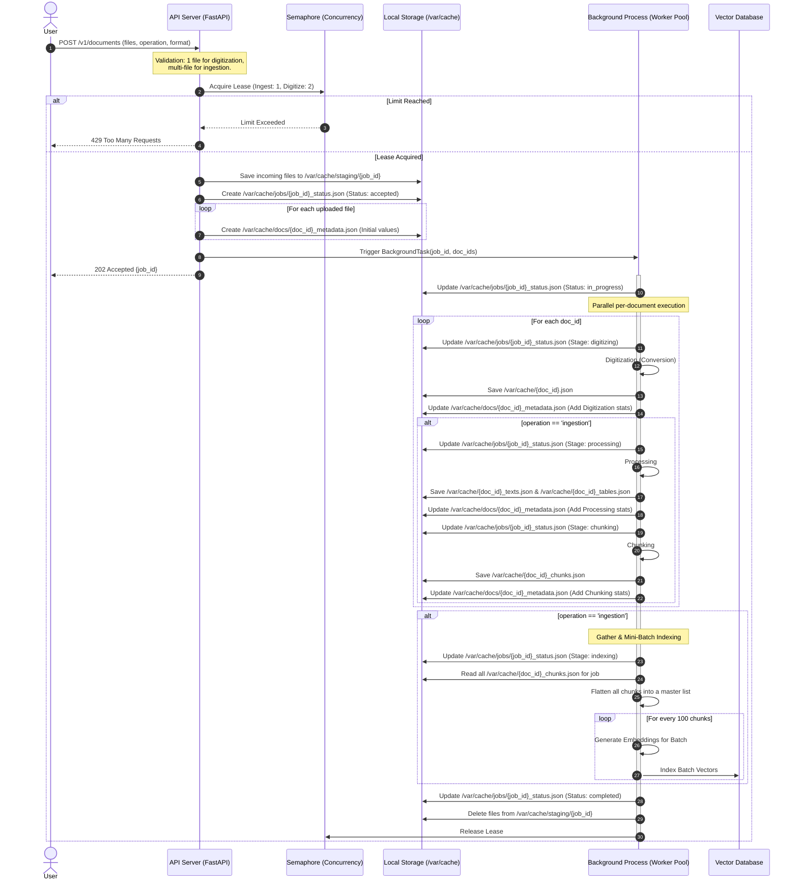

# Digitize Documents Service 
 
## Current Design: 

User can interact with document ingestion pipeline via cli commands and can run the below command to run the ingestion(convert/process/chunk/index) after placing the documents in the expected directory of the host i.e. `/var/lib/ai-services/applications/<app-name>/docs`.
```
ai-services application start <app-name> --pod=<app-name>--ingest-docs 
```
In case if user wants to clean it up, can run below command which will clean up the vdb & local cache of processed files. 
```
ai-services application start <app-name> --pod=<app-name>--clean-docs 
```
There is no option to just convert and not ingest the converted content into the vdb. 

## Non-Goals:

- **Horizontal Scaling:** The service is architected for single-replica deployment; multi-replica configurations are not supported as they introduce contention that degrades the performance of the downstream vLLM inference engine.
- **Duplicate Filename Resolution:** The system will not resolve or rename duplicate filenames within a single request payload; such requests will be rejected.

## Proposal: 
 
Recognizing the need for a more scalable and accessible architecture, we are moving to convert the current CLI into a microservice that offers REST endpoints for digitize‑document tasks. The microservice will support the following capabilities:

### File Conversion

- Convert the source file (e.g., PDF) into the required output format.
- Return the converted result through the API.

### Document Ingestion Workflow
After conversion, the document will be ingested via a structured processing pipeline that includes:

- Extracting and processing text and tables.
- Chunking the extracted content.
- Generating embeddings and indexing them into the vector database (VDB).

### External Service Exposure

- The microservice will be made accessible for external, end‑user consumption.
- Port 4000 may be used for hosting and exposure.
 
## Endpoints: 

| Method | Endpoint | Description |
| :--- | :--- | :--- |
| **POST** | `/v1/documents` | Uploads files for async processing. Ingestion by default. Accepts `operation` and `output_format` as optional flags. Returns `job_id` to track the processing. |
| **GET** | `/v1/documents/jobs` | Retrieves information about all the jobs. |
| **GET** | `/v1/documents/jobs/{job_id}` | Retrieves information about `job_id`. |
| **GET** | `/v1/documents` | Retrieves all the documents with its metadata. |
| **GET** | `/v1/documents/{id}` | Retrieves metadata of a specific document. |
| **GET** | `/v1/documents/{id}/content` | Retrieves digitized content of the specific document. |
| **DELETE** | `/v1/documents/{id}` | Removes a specific document from vdb & clear its cache. |
| **DELETE** | `/v1/documents` | Bulk deletes all documents from vdb & cache. Required param `confirm=true` to proceed the deletion. |

---

### POST /v1/documents - Async Ingestions/Digitizations

**Content Type:** multipart/form-data 
 
**Query Params:**
- **operation**     - str  - Optional param to mention the operation to do on the attached files. Options: 'ingestion/digitization', Default: 'ingestion'
- **output_format** - str  - Optional param to mention the required output format of the pdf, Options: 'md/text/json', Default: 'json'

**Description:**
- User can pass one or more pdfs directly as a byte stream with the optional query params.
- API Server should do following
- Use semaphore based concurrency limiting to globally limit 2 requests for digitization and 1 request for ingestion.
- Validate params to identify whether its a digitization or ingestion operation.
- Validation:
    - In case of digitization:
        - Only 1 file is allowed per request
        - No limit on the number of pages
    - In case of ingestion:
        - There are no limits(number of files/number of pages per file)
- Generate UUID for job as well as for documents.
- Temporarily write the input documents into the staging directory `/var/cache/staging/<job_id>`
- Write `<job_id>_status.json` inside `/var/cache/jobs` with initial status of job submission with submitted documents.
- Write `<doc_id>_metadata.json` for each document inside `/var/cache/docs` to store the finer metadata details of a documents.
- Start the ingestion in a background process.
- End the request with returning `job_id` as response and 202 Accepted status.
- Background process should do following
    - Start the process pipeline.
    - Atomically write status into `/var/cache/<job_id>_status.json` for every meaningful update happening in the pipeline. 
    - Clean staged directory `/var/cache/staging/<job_id>` once the process completes.
    - Keep `<job_id>_status.json` for preserving the history.
- **Notes:** 
    - Digitization tasks run in an isolated worker pool and are not shared with the Ingestion worker pools.
    - `output_format` passed will be ignored in case of ingestion, .
    - Users can submit digitized documents for ingestion; if the file is not cleaned using DELETE, the pipeline will use its cached version.
    - `/var/cache` is the persistent volume mounted by the runtime(Podman/OpenShift) inside the digitize document service container. 
    - In both ingestion/digitization, fastapi's `BackgroundTasks` can be used to run the process pipeline. Internally it can offload the tasks to child process pools. This would help in accessing the semaphore in API server's process for concurrency limiting.

#### Workflow:


**Sample curl for ingestion:**
```
> curl -X 'POST' \ 
  'http://localhost:4000/v1/documents' \
  -F 'files=@/path/to/file1.pdf'
  -F 'files=@/path/to/file2.pdf'
> 
``` 
**Sample curl for digitization:**
```
> curl -X 'POST' \ 
  'http://localhost:4000/v1/documents?operation=digitization&output_format=md' \
  -F 'files=@/path/to/file3.pdf'
> 
``` 

**Response codes:** 

| Status Code | Description | Details |
| :--- | :--- | :--- |
| **202 Accepted** | Success | Request accepted. |
| **400 Bad Request** | Missing File | No file was attached to the request. |
| **400 Bad Request** | Duplicate Files | Request contains files with duplicate names. |
| **415 Unsupported Media Type** | Invalid Format | File must be a valid, non-corrupt PDF. |
| **429 Too Many Requests** | Rate Limit | Request denied due to high volume (throttling). |
| **500 Internal Server Error** | Server Error | An unexpected error occurred on the server side. | 

**Sample response:**

```
{
    "job_id": "c7b2ee21-ccc2-5d93-9865-7fcea2ea9623"
}
```

---

### GET /v1/documents/jobs
- Returns high level status of all the submitted jobs(ingestion/digitization)

**Query Params:**
- latest - bool  - Optional param to return the latest ingestion status
- limit  - int - Optional. Number of records to return per page. Default: 20.
- offset - int - Optional. Number of records to skip. Default: 0.
- status - str - Optional. Filter based on status, possible values: accepted/in_progress/completed/failed.

**Sample curl:**
```
> curl \ 
  'http://localhost:4000/v1/document/jobs
>  
```

**Response codes:** 
| Status Code | Description | Details |
| :--- | :--- | :--- |
| **200 OK** | Success | Returns paginated job list with its status, stats, and individual doc states. |
| **500 Internal Server Error** | Server Error | Internal failure while retrieving job information. |

**Sample response:**

```
{
    "pagination": {
        "total": 145,
        "limit": 20,
        "offset": 0
    },
    "data": [
        {
            "job_id": "c7b2ee21-ccc2-5d93-9865-7fcea2ea9623",
            "operation": "ingestion",
            "status": "completed",
            "submitted_at": "2025-12-10T16:40:00Z",
            "documents": [
                {...}
            ],
            "error": ""
        },
        {
            "job_id": "stb34e21-9865-5d93-ccc2-8gcea2ea23456",
            "operation": "digitization",
            "status": "in_progress",
            "submitted_at": "2026-01-10T10:00:00Z",
            "documents": [
                {...}
            ],
            "error": ""
        }
    ]
}
```

**With latest=true**
```
{
    "pagination": {
        "total": 1,
        "limit": 20,
        "offset": 0
    },
    "data": [
        {
            "job_id": "stb34e21-9865-5d93-ccc2-8gcea2ea23456",
            "operation": "digitization",
            "status": "in_progress",
            "submitted_at": "2026-01-10T10:00:00Z",
            "documents": [
                {
                    "id": "c7b2ee21-ccc2-5d93-9865-7fcea2ea9623",
                    "name": "file3.pdf",
                    "status": "completed"
                }
            ],
            "error": ""
        }
    ]
}
```

---

### GET /v1/documents/jobs/{job_id}
- Returns detailed status of job_id specified.

**Sample curl:**
```
> curl \ 
  'http://localhost:4000/v1/document/jobs/stb34e21-9865-5d93-ccc2-8gcea2ea23456
>  
```

**Response codes:** 
| Status Code | Description | Details |
| :--- | :--- | :--- |
| **200 OK** | Success | Returns current/last job status, stats, and individual doc states. |
| **404 Not Found** | No Job Found | No job Found |
| **500 Internal Server Error** | Server Error | Internal failure while retrieving job information. |

**Sample response:**
```
{
    "job_id": "stb34e21-9865-5d93-ccc2-8gcea2ea23456",
    "operation": "digitization",
    "status": "in_progress",
    "submitted_at": "2026-01-10T10:00:00Z",
    "documents": [
        {
            "id": "6083ecba-dd7e-572e-8cd5-5f950d96fa54",
            "name": "file3.pdf",
            "status": "in_progress"
        }
    ],
    "error": ""
}
```

---

### GET /v1/documents
- Returns high level information of all the documents processed(ingested/digitized) sorted by submitted_time.

**Query Params:**
- limit  - int - Optional. Number of records to return per page. Default: 20.
- offset - int - Optional. Number of records to skip. Default: 0.
- status - str - Optional. Filter based on status, possible values: accepted/in_progress/completed/failed.
- name   - str - Optional. Filter based on document name.

**Sample curl:**
```
> curl \ 
  'http://localhost:4000/v1/documents?limit=20
>  
```
**Response codes:**
| Status Code | Description | Details |
| :--- | :--- | :--- |
| **200 OK** | Success | Returns paginated documents list and their metadata. |
| **400 Bad Request** | Invalid/Missing values on Filter | Filter contains invalid or missing values |
| **500 Internal Error** | Server Failure | Failure to query the Vector Database or access the local storage record. |

**Sample response:**
```
{
    "pagination": {
        "total": 145,
        "limit": 20,
        "offset": 0
    },
    "data": [
        {
            "id": "c7b2ee21-ccc2-5d93-9865-7fcea2ea9623",
            "name": "file1.pdf",
            "type": "digitization",
            "status": "completed"
        },
        {
            "id": "6083ecba-dd7e-572e-8cd5-5f950d96fa54",
            "name": "file2.pdf",
            "type": "digitization",
            "status": "in_progress"
        },
        {
            "id": "4365eifa-dd7e-8cd5-572e-5f950d96fa54",
            "name": "file2.pdf",
            "type": "ingestion",
            "status": "completed"
        }
    ]
}
```

---

### GET /v1/documents/{id}
- Returns details document's information of specified document id. 

**Query Params:**
- details - bool - Optional param. Enable this to get detailed information regarding the document like number of pages & tables, timings of ingestion stages.

**Sample curl:**
```
> curl \ 
  'http://localhost:4000/v1/documents/6083ecba-dd7e-572e-8cd5-5f950d96fa54
>  
```
**Response codes:**
| Status Code | Description | Details |
| :--- | :--- | :--- |
| **200 OK** | Success | Returns metadata of the pdf's id requested. |
| **404 Not Found** | No Data | No ingested documents matching the id. |
| **500 Internal Error** | Server Failure | Failure to query the Vector Database or access the local storage record. |

**Sample response:**
```
{
    "id": "4365eifa-dd7e-8cd5-572e-5f950d96fa54",
    "name": "file2.pdf",
    "type": "ingestion",
    "status": "completed",
    "output_format": "json",
    "digitized_at": "2026-01-10T10:00:00Z",
    "error": ""
}
```

**With details=true:**
```
{
    "id": "4365eifa-dd7e-8cd5-572e-5f950d96fa54",
    "name": "file2.pdf",
    "type": "ingestion",
    "status": "completed",
    "output_format": "json",
    "digitized_at": "2026-01-10T10:00:00Z",
    "error": "",
    "timing_in_secs": {
        "digitizing": 120,
        "processing": 300,
        "chunking": 10,
        "indexing": null
    },
    "pages": 200,
    "tables": 20
}
```

---

### GET /v1/documents/{id}/content
**Description:**
- Returns the digitized content of the requested document. 
- For documents submitted via `digitization`, this returns the format requested during POST (md/text/json).
- For documents submitted via `ingestion`, this defaults to returning the extracted `json` representation of the document stored in the local cache.

**Sample curl:**
```
> curl \ 
  'http://localhost:4000/v1/documents/6083ecba-dd7e-572e-8cd5-5f950d96fa54/content
>  
```

**Response codes:**
| Status Code | Description | Details |
| :--- | :--- | :--- |
| **200 OK** | Success | Returns digitized content of requested docuemnt. |
| **202 Accepted** | Success | Digitization is in progress |
| **404 Not Found** | No Data | No documents matching the id. |
| **500 Internal Error** | Server Failure | Failure to query the Vector Database or access the local storage record. |

**Sample response:**
```
{
    "result": ... // Based on output_format request, result will contain str in case of md/text, dict in case of json output format, sample json file can be found [here](https://github.com/docling-project/docling-core/blob/5a7e567323fe250fa0b0211f92d8931e0ae64740/examples/2408.09869v3.json),
    "output_format": "md" // text & json also are possible values
}
```
---

### DELETE /v1/documents/{id}
- Ensure the document is not part of an active job
- Remove the vectors of a specific document in vdb if it is ingested and clean up the local cache generated for the document

**Sample curl:**
```
> curl -X DELETE \ 
  'http://localhost:4000/v1/documents/6083ecba-dd7e-572e-8cd5-5f950d96fa54
>  
```
**Response codes:**

| Status Code | Description | Details |
| :--- | :--- | :--- |
| **204 No Content** | Success | File successfully purged from VDB and local cache. |
| **404 Not Found** | Missing Resource | The specified `{document_id}` does not exist in the system. |
| **409 Conflict** | Resource Locked | Action denied; document is part of an active job. |
| **500 Internal Error** | Server Failure | Error occurred while communicating with VDB or deleting cache files. |

---

### DELETE /v1/documents
- Ensure there is no active job.
- Equivalent to clean-db command, will clean up the vdb and remove the local cache.

**Query Params:**
- confirm - bool  - Required param to comfirm the bulk delete

**Sample curl:**
```
> curl -X DELETE\ 
  'http://localhost:4000/v1/documents?confirm=true
>  
```
**Response codes:**

| Status Code | Description | Details |
| :--- | :--- | :--- |
| **204 No Content** | Success | Full cleanup completed; VDB and local cache are now empty. |
| **409 Conflict** | Resource Locked | Action denied; an job is currently active. |
| **500 Internal Error** | Server Failure | Failure occurred during VDB truncation or recursive file deletion. |

---

## Recovery Strategy
In case of process crash (whether it's the FastAPI worker or the entire container) below strategy can be used to recover from the crash.

1. **Boot-up Scan:** When the FastAPI app starts, a routine should scan through  `/var/cache/jobs/*.json`.
2. **Identify Zombies:** Any job with a status of `accepted` or `in_progress` is a "zombie" because no worker could possibly be handling it yet.
3. **Mark as Failed:** Update those files to `status: failed` with an error message like `"System restarted during processing"`.
4. **Cleanup:** Trigger the deletion of the corresponding `/var/cache/staging/<job_id>` directories & user can use `DELETE /v1/documents/{id}` to cleanup stale documents.