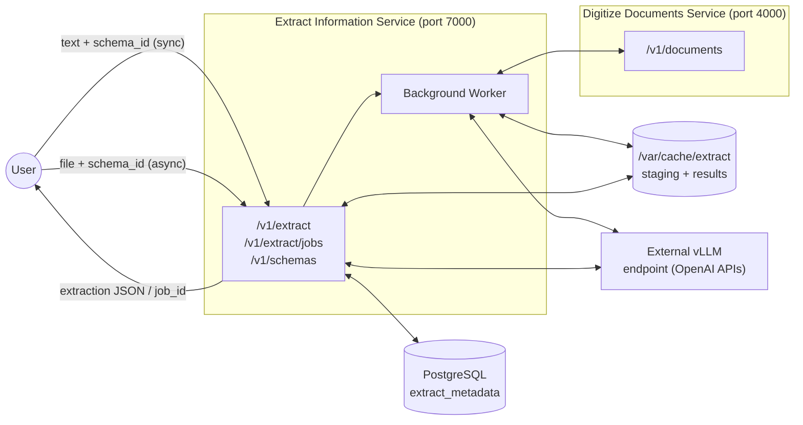
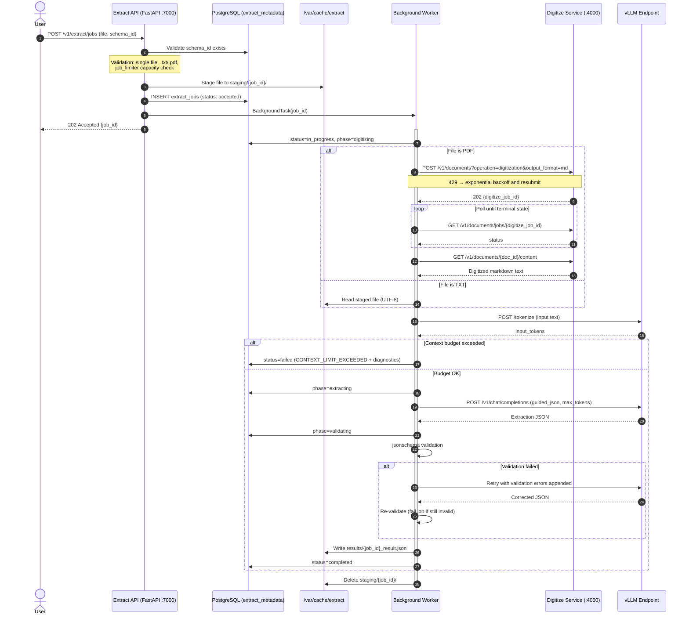

# Entity Extraction Service — Implementation Proposal

## 1. Overview

This document proposes the design and implementation of the **Entity Extraction** microservice for the AI-Services platform. The service takes relevant data from unstructured text and populates a user-supplied **JSON schema**, enabling robust information retrieval from documents such as emails, invoices, and contracts.

The service follows the architectural patterns already established:

- FastAPI application running as a Python service in a Podman container (ppc64le / RHEL).
- Semaphore-based concurrency limiting in front of the shared vLLM inference endpoint.
- PostgreSQL for durable metadata, initialized by an idempotent init container.
- `/var/cache`-backed staging and result files on a persistent volume.
- Boot-time recovery scan for zombie jobs.

Two execution paths are provided:

| Path                    | Endpoint                | Use case                                                                                                                                            |
|:------------------------|:------------------------|:----------------------------------------------------------------------------------------------------------------------------------------------------|
| **Synchronous**         | `POST /v1/extract`      | Raw text submitted inline. Blocking call, immediate JSON result.                                                                                    |
| **Asynchronous (jobs)** | `POST /v1/extract/jobs` | File uploads (`.pdf`, `.txt`). PDFs are digitized internally via the Digitize Documents REST API before extraction. Returns a `job_id` for polling. |

A central component of the design is the **Schema Registry**: a PostgreSQL-backed store of immutable extraction schemas. Users register a JSON schema (optionally with few-shot examples and a custom prompt) once, receive a `schema_id`, and reference it in every extraction request. This decouples schema management from extraction execution and lets the same schema be reused across sync and async paths.

### 1.1 Concept-to-Design Mapping

| Concept diagram element                                       | Design realization                                                                                                                                            |
|:--------------------------------------------------------------|:--------------------------------------------------------------------------------------------------------------------------------------------------------------|
| Input: text (e.g., digitized invoice from Digitize service)   | Sync `text` field; async worker fetches digitized content via `GET /v1/documents/{id}/content` on the digitize service                                        |
| Input: JSON schema with `"required": true` properties         | Registered schema in the Schema Registry (`json_schema` column, JSON Schema draft 2020-12)                                                                    |
| Input (optional): single-shot examples (text–JSON pairs)      | `examples` array stored per schema in the registry                                                                                                            |
| Config: Version                                               | Not managed by the service — schemas are immutable and unversioned (see Non-Goals). Users encode versions in the schema `name` if needed (e.g., `invoice-v2`) |
| Config: LLM (granite-3.3-8b-instruct / mistral-small-3.1-24b) | `MODEL_NAME` env var (service default)                                                                                                                        |
| Config (optional): custom prompt                              | `custom_prompt` column per schema, appended to the system prompt                                                                                              |
| Output: JSON populated according to input schema              | `data.extraction` in the response, validated server-side against the registered schema                                                                        |
| Output: pointer to input text                                 | `data.source` block (digitize `doc_id` for async, input word/token stats for sync)                                                                            |
| External dependency: OpenAI-compatible inferencing endpoint   | Existing vLLM endpoint (`OPENAI_BASE_URL`), shared semaphore                                                                                                  |
| SLAs: throughput / latency                                    | Governed by concurrency limits and the hard context-window guard (Section 6); to be quantified during performance testing                                     |

---

## 2. Non-Goals

- **Horizontal scaling:** Like the digitize and summarize services, this service is architected for single-replica deployment. Multi-replica deployments introduce contention on the vLLM inference engine and are out of scope.
- **UI:** No user interface is included in this document. The service is API-only. 
- **Schema versioning and mutation:** Schemas are **immutable**. There is no `PUT`/`PATCH` on schemas and no version chain. To change a schema, the user registers a new schema under a new name and deletes the old one when it is no longer referenced.
- **Document conversion / OCR:** The service does not implement PDF parsing or conversion. All non-plaintext formats are delegated to the Digitize Documents service over its REST API.
- **Chunked extraction of over-limit documents:** Inputs that exceed the model context window are rejected with a hard, diagnosable error rather than processed via chunk-and-merge. A merge strategy for extraction results is materially harder than for summaries (conflicting scalar values, entity deduplication) and is deferred to Future Enhancements.
- **Multi-file jobs:** Each async job processes exactly one file. Clients submit one job per file.

---

## 3. Architecture



**Key interactions:**

- The **sync path** never touches the digitize service or the jobs table. It tokenizes, guards the context window, calls vLLM, validates, and returns.
- The **async worker** orchestrates: stage file → (PDF only) digitize via REST → fetch digitized content → guard → extract → validate → persist result.
- Both paths share the global vLLM connection semaphore (Section 8).
- The service is exposed externally on **port 7000** (configurable), avoiding collision with digitize (4000) and the AI-Services backend server.

---

## 4. Endpoints

| Method | Endpoint                           | Description                                                           |
|:---|:-----------------------------------|:----------------------------------------------------------------------|
| **POST** | `/v1/schemas`                      | Register a new immutable extraction schema. Returns `schema_id`.      |
| **GET** | `/v1/schemas`                      | List registered schemas with pagination and name filter.              |
| **GET** | `/v1/schemas/{schema_id}`          | Retrieve a specific schema definition and its examples.               |
| **DELETE** | `/v1/schemas/{schema_id}`          | Delete a schema. Rejected if any job references it.                   |
| **DELETE** | `/v1/schemas`                      | Bulk delete all schemas. Requires `confirm=true`.                     |
| **POST** | `/v1/extract`                      | Synchronous extraction on inline text against a registered schema.    |
| **POST** | `/v1/extract/jobs`                 | Submit a file (`.txt`/`.pdf`) for async extraction. Returns `job_id`. |
| **GET** | `/v1/extract/jobs`                 | List extraction jobs with pagination and filters.                     |
| **GET** | `/v1/extract/jobs/{job_id}`        | Get detailed status of a specific job.                                |
| **GET** | `/v1/extract/jobs/{job_id}/result` | Retrieve the extraction result as a sub-resource of the job.          |
| **DELETE** | `/v1/extract/jobs/{job_id}`        | Delete a job record and its result file.                              |
| **DELETE** | `/v1/extract/jobs`                 | Bulk delete all jobs and results. Requires `confirm=true`.            |


---

## 5. Schema Registry

### 5.1 POST /v1/schemas — Register Schema

**Content-Type:** `application/json`

**Request body:**

| Field | Type | Required | Description |
|:---|:---|:---|:---|
| `name` | string | Yes | Unique, human-readable identifier (e.g., `invoice-extraction`). 1–200 chars, `[a-zA-Z0-9._-]`. |
| `description` | string | No | Free-text description of what the schema extracts. |
| `json_schema` | object | Yes | JSON Schema (draft 2020-12). Root must be `type: object`. Properties may be tagged `"required": true` (see 5.1.1). |
| `examples` | array | No | Few-shot examples: `[{"text": "...", "output": {...}}]`. Max 5. Each `output` must validate against `json_schema`. |
| `custom_prompt` | string | No | Extra instructions appended to the system prompt (e.g., domain conventions, date formats). Max 2,000 chars. |

**Response codes:**

| Status | Description |
|:---|:---|
| 201 Created | Schema registered. Returns full schema record with `schema_id`. |
| 400 Bad Request | Invalid JSON schema, invalid example, or size limit exceeded. |
| 409 Conflict | A schema with this `name` already exists. |
| 500 Internal Server Error | Database failure. |

**Sample request:**

```bash
curl -X POST http://localhost:7000/v1/schemas \
  -H "Content-Type: application/json" \
  -d '{
    "name": "invoice-extraction",
    "description": "Extracts core commercial fields from invoices",
    "json_schema": {
      "type": "object",
      "properties": {
        "invoice_number": {"type": "string", "required": true},
        "invoice_date":   {"type": "string", "format": "date"},
        "vendor_name":    {"type": "string", "required": true},
        "total_amount":   {"type": "number", "required": true},
        "currency":       {"type": "string"},
        "line_items": {
          "type": "array",
          "items": {
            "type": "object",
            "properties": {
              "description": {"type": "string"},
              "quantity":    {"type": "number"},
              "unit_price":  {"type": "number"}
            }
          }
        }
      }
    },
    "examples": [
      {
        "text": "INVOICE #INV-2041 ... Acme GmbH ... TOTAL: EUR 1,204.50",
        "output": {
          "invoice_number": "INV-2041",
          "vendor_name": "Acme GmbH",
          "total_amount": 1204.50,
          "currency": "EUR"
        }
      }
    ]
  }'
```

**Sample response (201):**

```json
{
    "schema_id": "9f1c2a4e-77aa-4c3b-9d20-3f4b1a6c8e02",
    "name": "invoice-extraction",
    "description": "Extracts core commercial fields from invoices",
    "created_at": "2026-07-07T09:30:00Z"
}
```

#### 5.1.1 Required-property convention

The concept diagram specifies that required properties "may be tagged via `"required": true`". Standard JSON Schema expresses requiredness as a `required` array at the object level, not a per-property boolean. The registry accepts **both** forms and normalizes on write:

- If a property carries `"required": true`, the registry moves its name into the parent object's `required` array and strips the non-standard boolean.
- The stored, normalized schema is always valid draft 2020-12. `GET /v1/schemas/{id}` returns the normalized form.

This keeps the user-facing convention from the concept while ensuring the stored schema works with standard validators (`jsonschema` library) and vLLM guided decoding.

**Validation rules:**

1. `name` is unique — conflict returns `409`.
2. `json_schema` must parse as a valid draft 2020-12 schema (checked with `jsonschema.validators.Draft202012Validator.check_schema`) with root `type: object`.
3. Every `examples[i].output` must validate against the normalized schema — otherwise `400` identifying the failing example index.

#### 5.1.2 Schema size validation:

REGISTRATION_BUDGET_FRACTION is the maximum share of the model's context window (MAX_MODEL_LEN) that a schema's fixed prompt overhead — the schema itself, its few-shot examples, and the prompt template — is allowed to consume. It's checked once, at POST /v1/schemas time.
The reasoning: every extraction prompt is composed of two parts — a fixed part that's identical for every request against that schema (schema JSON + examples + system prompt + reserved output tokens) and a variable part (the user's input text). The fraction draws the line between them. With REGISTRATION_BUDGET_FRACTION = 0.5 and MAX_MODEL_LEN = 32768:

```commandline
schema_tokens + examples_tokens + PROMPT_OVERHEAD_TOKENS + MIN_OUTPUT_TOKENS
    <= REGISTRATION_BUDGET_FRACTION × MAX_MODEL_LEN     (e.g. 0.5)
```
Fixed overhead may use at most 0.5 × 32768 = 16,384 tokens. A registration exceeding this is rejected with a 400 and a token breakdown.
Which guarantees every accepted schema leaves at least 16,384 tokens (~12k English words) for input text on every future extraction.

Tuning it is a trade-off in one direction or the other. Raise it toward 0.8, and you allow very elaborate schemas with many long examples, but every extraction against them can only handle short inputs (~6.5k tokens at 0.8). Lower it toward 0.3 and you force lean schemas but guarantee room for long documents. 0.5 is just a sensible default that says neither side may starve the other; an operator deploying a larger-context model (say 128k) or a schema-heavy workload would adjust it without code changes.
> Note: it's an admission check, not a replacement for the per-request context guard in Section 6. The Section 6 guard still runs on every extraction, because input text length is only known at request time. The fraction just ensures the guard can never be pre-doomed by the schema alone.

### 5.2 GET /v1/schemas — List Schemas

**Query parameters:**

| Parameter | Type | Required | Description |
|:---|:---|:---|:---|
| `limit` | int | No | Records per page (1–100). Default: `20`. |
| `offset` | int | No | Records to skip. Default: `0`. |
| `name` | string | No | Case-insensitive substring filter on schema name. |

**Response codes:**

| Status | Description |
|:---|:---|
| 200 OK | Paginated schema list (metadata only — `json_schema` bodies excluded to keep the list light). |
| 400 Bad Request | Invalid query parameter values. |
| 500 Internal Server Error | Database failure. |

**Sample response (200):**

```json
{
    "pagination": {"total": 3, "limit": 20, "offset": 0},
    "data": [
        {
            "schema_id": "9f1c2a4e-77aa-4c3b-9d20-3f4b1a6c8e02",
            "name": "invoice-extraction-v1",
            "description": "Extracts core commercial fields from invoices",
            "example_count": 1,
            "created_at": "2026-07-07T09:30:00Z"
        },
      {
            "schema_id": "9f1c2a4e-77aa-4c3b-9d20-3f4b1a6c8e03",
            "name": "invoice-extraction-v2",
            "description": "Extracts core commercial fields from invoices",
            "example_count": 1,
            "created_at": "2026-07-07T09:30:00Z"
        },
      {
            "schema_id": "9f1c2a4e-77aa-4c3b-9d20-3f4b1a6c8e04",
            "name": "invoice-extraction-v3",
            "description": "Extracts core commercial fields from invoices",
            "example_count": 1,
            "created_at": "2026-07-07T09:30:00Z"
        }
    ]
}
```

### 5.3 GET /v1/schemas/{schema_id}

Returns the full schema record including the normalized `json_schema`, `examples`, and `custom_prompt`.

| Status | Description |
|:---|:---|
| 200 OK | Full schema record. |
| 404 Not Found | No schema with this ID. |
| 500 Internal Server Error | Database failure. |

**Sample response (201):**

```json
{
  "schema_id": "9f1c2a4e-77aa-4c3b-9d20-3f4b1a6c8e02",
  "name": "invoice-extraction",
  "description": "Extracts core commercial fields from invoices",
  "json_schema": {
    "type": "object",
    "properties": {
      "invoice_number": {"type": "string"},
      "invoice_date":   {"type": "string", "format": "date"},
      "vendor_name":    {"type": "string"},
      "total_amount":   {"type": "number"},
      "currency":       {"type": "string"},
      "line_items": {
        "type": "array",
        "items": {
          "type": "object",
          "properties": {
            "description": {"type": "string"},
            "quantity":    {"type": "number"},
            "unit_price":  {"type": "number"}
          }
        }
      }
    },
    "required": ["invoice_number", "vendor_name", "total_amount"]
  },
  "examples": [
    {
      "text": "INVOICE #INV-2041 ... Acme GmbH ... TOTAL: EUR 1,204.50",
      "output": {
        "invoice_number": "INV-2041",
        "vendor_name": "Acme GmbH",
        "total_amount": 1204.50,
        "currency": "EUR"
      }
    }
  ],
  "custom_prompt": null,
  "schema_tokens": 118,
  "examples_tokens": 74, 
  "prompt tokens": 0,
  "created_at": "2026-07-07T09:30:00Z"
}
```
### 5.4 DELETE /v1/schemas/{schema_id}

Deletes the schema. Since jobs hold a foreign key to schemas (`ON DELETE RESTRICT`), deletion is rejected while **any** job — active or historical — references the schema. Users must delete referencing jobs first (individually or via bulk job delete).

> **Rationale:** With immutable schemas, a job's result is only interpretable alongside the schema it was extracted against. RESTRICT preserves that referential integrity; results never point at a vanished schema.

| Status | Description |
|:---|:---|
| 204 No Content | Schema deleted. |
| 404 Not Found | No schema with this ID. |
| 409 Conflict | One or more jobs reference this schema. Response lists up to 10 referencing `job_id`s. |
| 500 Internal Server Error | Database failure. |

---
### 5.5 DELETE /v1/schemas (Bulk Delete)

**Query parameters:** `confirm=true` (required).

1. Validate `confirm=true` (else `400`).
2. Reject with `409` if any schema is used in an extract_job.
3. Delete all `schema` rows.
4. Return `204 No Content`.

| Status | Description                      |
|:---|:---------------------------------|
| 204 No Content | Full cleanup completed.          |
| 400 Bad Request | `confirm` missing or not `true`. |
| 409 Conflict | An active schema exists.         |
| 500 Internal Server Error | Failure during deletion.         |
---

### 5.6. Synchronous Extraction — POST /v1/extract

**Content-Type:** `application/json`

**Request body:**

| Field | Type | Required | Description |
|:---|:---|:---|:---|
| `text` | string | Yes | Raw text to extract from. |
| `schema_id` | string | Yes | ID of a registered schema. |

**Processing logic:**

1. Validate `schema_id` exists (else `404`) and `text` is non-empty (else `400`).
2. Check the global vLLM semaphore; if all slots are occupied, return `429`.
3. Tokenize the input via the vLLM `/tokenize` API (exact count — same approach as the summarize service; no word-ratio estimation).
4. Apply the **hard context-window guard** (Section 6). If it fails, return `413` with per-input token diagnostics.
5. Build the extraction prompt (Section 8): system prompt + custom prompt + schema + few-shot examples + input text.
6. Call vLLM `/v1/chat/completions` with **guided JSON decoding** against the schema where supported, `temperature=0.0`.
7. Validate the model output against the normalized schema with `jsonschema`. On failure, perform **one bounded retry** with the validation errors appended to the prompt (Section 8.3). If the retry also fails, return `422`.
8. Return the extraction with metadata and token usage.

**Response codes:**

| Status | Description | Details |
|:---|:---|:---|
| 200 OK | Success | Extraction completed and validated against the schema. |
| 400 Bad Request | Invalid request | Missing/empty `text` or `schema_id`. |
| 404 Not Found | Unknown schema | `schema_id` does not exist in the registry. |
| 413 Payload Too Large | Context limit | Input + schema + prompt + reserved output exceeds `MAX_MODEL_LEN`. Error includes token diagnostics. |
| 422 Unprocessable Entity | Validation failed | Model output failed schema validation after retry. Error includes missing required properties and the raw model output for debugging. |
| 429 Too Many Requests | Rate limit | vLLM semaphore at capacity. |
| 500 Internal Server Error | Server error | Unexpected failure. |
| 503 Service Unavailable | AI service down | vLLM endpoint unreachable. |

**Sample request:**

```bash
curl -X POST http://localhost:7000/v1/extract \
  -H "Content-Type: application/json" \
  -d '{
    "schema_id": "9f1c2a4e-77aa-4c3b-9d20-3f4b1a6c8e02",
    "text": "INVOICE #INV-3377\nBilled by: Northwind Traders\nDate: 2026-06-14\nTOTAL DUE: USD 8,420.00 ..."
  }'
```

**Sample response (200):**

```json
{
    "data": {
        "extraction": {
            "invoice_number": "INV-3377",
            "invoice_date": "2026-06-14",
            "vendor_name": "Northwind Traders",
            "total_amount": 8420.00,
            "currency": "USD",
            "line_items": []
        },
        "schema_id": "9f1c2a4e-77aa-4c3b-9d20-3f4b1a6c8e02",
        "source": {
            "input_type": "text",
            "input_tokens": 291
        }
    },
    "meta": {
        "model": "ibm-granite/granite-3.3-8b-instruct",
        "processing_time_ms": 1830,
        "validation_attempts": 1
    },
    "usage": {
        "input_tokens": 1104,
        "output_tokens": 96,
        "total_tokens": 1200
    }
}
```

> `data.source` is the sync-path realization of the concept diagram's "pointer to input text" output. On the async path this block instead carries the digitize `doc_id` (Section 10.4), which is a durable pointer to the cached digitized content.

**Sample error (413) with token diagnostics:**

```json
{
    "error": {
        "code": "CONTEXT_LIMIT_EXCEEDED",
        "message": "Input does not fit in the model context window. Reduce input size or use the async job path with a smaller document.",
        "status": 413,
        "details": {
            "max_model_len": 32768,
            "input_tokens": 30125,
            "schema_tokens": 1480,
            "examples_tokens": 850,
            "prompt_overhead_tokens": 150,
            "reserved_output_tokens": 2960,
            "total_required_tokens": 35565,
            "excess_tokens": 2797
        }
    }
}
```

---
### 5.7 POST /v1/extract/jobs — Create Extraction Job

**Content-Type:** `multipart/form-data`

**Form parameters:**

| Parameter   | Type   | Required | Description                        |
|:------------|:-------|:---------|:-----------------------------------|
| `file`      | file   | Yes      | Exactly one `.txt` or `.pdf` file. |
| `schema_id` | string | Yes      | ID of a registered schema.         |
| `job_name`  | string | No       | Optional human-readable label.     |

**Validation rules:**

- Exactly one file per request (multiple files → `400`).
- Extension must be `.txt` or `.pdf`; PDF magic bytes are checked (corrupt/mislabeled → `415`).
- `schema_id` must exist (else `404`).
- No word/page limit is enforced at submission time — the context-window guard runs *after* digitization, when the true text is known. Over-limit documents fail the job with full token diagnostics rather than being rejected blind at upload.

**Processing flow (request thread):**

1. Validate file and parameters.
2. Check `job_limiter`; if all slots are occupied, return `429`.
3. Generate `job_id` (UUID).
4. Stage the file to `/var/cache/extract/staging/{job_id}/`.
5. Insert a row into `extract_jobs` with status `accepted`.
6. Launch background processing via FastAPI `BackgroundTasks` (offloading to the worker as in the digitize design).
7. Return `202 Accepted` with `{ "job_id": "..." }`.

**Background worker:**

1. Acquire `job_limiter`; update row → `status='in_progress'`, `metadata.phase='digitizing'` (PDF) or `'extracting'` (TXT).
2. **PDF path:** submit to digitize — `POST http://digitize-url/v1/documents?operation=digitization&output_format=md` (markdown preserves table structure, which matters for invoices/contracts). Store `digitize_job_id`. Poll `GET /v1/documents/jobs/{digitize_job_id}` every `DIGITIZE_POLL_INTERVAL_SECS` (default 10) until `completed`/`failed` or `DIGITIZE_JOB_TIMEOUT_SECS` (default 3600). Fetch text via `GET /v1/documents/{doc_id}/content`; store `digitize_doc_id`.
   **TXT path:** read the staged file (UTF-8 decode).
3. Tokenize; run the hard context-window guard. On breach → `status='failed'`, `error='CONTEXT_LIMIT_EXCEEDED'`, diagnostics in `metadata`.
4. `metadata.phase='extracting'`: build prompt, acquire `concurrency_limiter`, call vLLM.
5. `metadata.phase='validating'`: validate; one bounded retry on failure (Section 9.3).
6. Write `/var/cache/extract/results/{job_id}_result.json`.
7. Update row → `status='completed'`, `completed_at=now()` (or `failed` + `error`).
8. Delete `/var/cache/extract/staging/{job_id}/`; release `job_limiter`.

> **Digitize cache note:** the digitized document remains in the digitize service's cache and registry after extraction, keyed by `digitize_doc_id`. Users manage its lifecycle through the digitize service's own `DELETE /v1/documents/{id}`.

**Response codes:**

| Status | Description |
|:---|:---|
| 202 Accepted | Job created. |
| 400 Bad Request | Missing file, multiple files, or missing `schema_id`. |
| 404 Not Found | Unknown `schema_id`. |
| 415 Unsupported Media Type | Not a valid `.txt` or `.pdf`. |
| 429 Too Many Requests | Job concurrency at capacity. |
| 500 Internal Server Error | Unexpected failure. |

**Sample request:**

```bash
curl -X POST http://localhost:7000/v1/extract/jobs \
  -F "file=@contract_2026.pdf" \
  -F "schema_id=9f1c2a4e-77aa-4c3b-9d20-3f4b1a6c8e02" \
  -F "job_name=Q3 vendor contract"
```

**Sample response (202):**

```json
{
    "job_id": "b6d1f0aa-2c34-4e19-8f0d-91a7c55e3b77"
}
```
---

### 5.8 GET /v1/extract/jobs — List Jobs

**Query parameters:**

| Parameter | Type | Required | Description |
|:---|:---|:---|:---|
| `latest` | bool | No | Return only the most recent job. Default: `false`. |
| `limit` | int | No | Records per page (1–100). Default: `20`. |
| `offset` | int | No | Records to skip. Default: `0`. |
| `status` | string | No | Filter: `accepted`, `in_progress`, `completed`, `failed`. |
| `schema_id` | string | No | Filter jobs by the schema they extract against. |

| Status | Description |
|:---|:---|
| 200 OK | Paginated job list. |
| 400 Bad Request | Invalid query parameter values. |
| 500 Internal Server Error | Database failure. |

**Sample response (200):**

```json
{
    "pagination": {"total": 12, "limit": 20, "offset": 0},
    "data": [
        {
            "job_id": "b6d1f0aa-2c34-4e19-8f0d-91a7c55e3b77",
            "job_name": "Q3 vendor contract",
            "schema_id": "9f1c2a4e-77aa-4c3b-9d20-3f4b1a6c8e02",
            "status": "completed",
            "document_name": "contract_2026.pdf",
            "submitted_at": "2026-07-07T10:15:00Z",
            "completed_at": "2026-07-07T10:19:42Z"
        }
    ]
}
```

### 5.9 GET /v1/extract/jobs/{job_id} — Job Details

| Status | Description |
|:---|:---|
| 200 OK | Full job status. |
| 404 Not Found | No job with this ID. |
| 500 Internal Server Error | Database failure. |

**Sample response (200, in progress):**

```json
{
    "job_id": "b6d1f0aa-2c34-4e19-8f0d-91a7c55e3b77",
    "job_name": "Q3 vendor contract",
    "schema_id": "9f1c2a4e-77aa-4c3b-9d20-3f4b1a6c8e02",
    "status": "in_progress",
    "document": {
        "name": "contract_2026.pdf",
        "source_type": "pdf",
        "digitize_job_id": "stb34e21-9865-5d93-ccc2-8gcea2ea23456",
        "digitize_doc_id": null
    },
    "metadata": {
        "phase": "digitizing"
    },
    "submitted_at": "2026-07-07T10:15:00Z",
    "completed_at": null,
    "error": null
}
```

### 5.10 GET /v1/extract/jobs/{job_id}/result — Get Extraction Result

| Status | Description |
|:---|:---|
| 200 OK | Extraction result. |
| 202 Accepted | Job still in progress. |
| 404 Not Found | No job with this ID, or job failed (error details live on the job resource). |
| 500 Internal Server Error | Failure reading result file. |

**Sample response (200):**

```json
{
    "data": {
        "extraction": {
            "invoice_number": "INV-3377",
            "vendor_name": "Northwind Traders",
            "total_amount": 8420.00,
            "currency": "USD"
        },
        "schema_id": "9f1c2a4e-77aa-4c3b-9d20-3f4b1a6c8e02",
        "source": {
            "input_type": "file",
            "document_name": "contract_2026.pdf",
            "digitize_doc_id": "6083ecba-dd7e-572e-8cd5-5f950d96fa54",
            "input_words": 6412,
            "input_tokens": 8850
        }
    },
    "meta": {
        "model": "ibm-granite/granite-3.3-8b-instruct",
        "processing_time_ms": 262400,
        "validation_attempts": 1,
        "timing_in_secs": {
            "digitizing": 245.0,
            "extracting": 14.2,
            "validating": 0.2
        }
    },
    "usage": {
        "input_tokens": 11284,
        "output_tokens": 132,
        "total_tokens": 11416
    }
}
```

### 5.11 DELETE /v1/extract/jobs/{job_id}

Deletes the job row and its result file. Only `completed` or `failed` jobs may be deleted. Does **not** delete the digitized document in the digitize service (managed independently).

| Status | Description |
|:---|:---|
| 204 No Content | Job and result deleted. |
| 404 Not Found | No job with this ID. |
| 409 Conflict | Job is still active (`accepted` or `in_progress`). |
| 500 Internal Server Error | Unexpected failure. |

### 5.12 DELETE /v1/extract/jobs — Bulk Delete

**Query parameters:** `confirm=true` (required).

1. Validate `confirm=true` (else `400`).
2. Reject with `409` if any job is `accepted`/`in_progress`.
3. Delete all `extract_jobs` rows, all result files, and any remaining staging directories.
4. Return `204 No Content`.

|  Status                   | Description |
|:--------------------------|:---|
| 204 No Content            | Full cleanup completed. |
| 400 Bad Request           | `confirm` missing or not `true`. |
| 409 Conflict              | An active job exists. |
| 500 Internal Server Error | Failure during deletion. |

---


## 6. Hard Context-Window Guard

Extraction is a single-pass operation in v1 (no chunk-and-merge — see Non-Goals), so the entire prompt must fit in `MAX_MODEL_LEN` (32,768 tokens for granite on Spyre in the current configuration). The guard is enforced identically on the sync path and inside the async worker.

### 6.1 Budget calculation

```
input_tokens          = /tokenize(input_text)                  # exact
schema_tokens         = /tokenize(json.dumps(normalized_schema))   # computed once at schema registration, cached in DB
examples_tokens       = /tokenize(rendered few-shot block)         # cached at registration
prompt_overhead       = PROMPT_OVERHEAD_TOKENS 
reserved_output       = clamp(schema_tokens * OUTPUT_TOKEN_FACTOR,
                              MIN_OUTPUT_TOKENS, MAX_OUTPUT_TOKENS)

total = input_tokens + schema_tokens + examples_tokens
        + prompt_overhead + reserved_output

require: total <= MAX_MODEL_LEN     # else 413 CONTEXT_LIMIT_EXCEEDED
max_tokens (LLM call) = reserved_output
```

**Output reservation rationale:** unlike summarization (output proportional to input), extraction output size is bounded by the **schema**, not the input — a 30-page contract still yields one JSON object shaped by the schema. `OUTPUT_TOKEN_FACTOR` defaults to `2.0` (the populated JSON is roughly the schema's keys plus values), clamped between `MIN_OUTPUT_TOKENS=512` and `MAX_OUTPUT_TOKENS=4096`. Schemas with unbounded arrays (e.g., `line_items`) are the reason for the generous factor and the 4,096 ceiling; all three knobs are env-configurable.

Rationale for choosing values in above formula:
1. OUTPUT_TOKEN_FACTOR: refer table below to figure out what number supports what kind of output. 5 is what is recommended to cover unbounded attributes in schemas. We could also obtain it from the user while creating schema in future enhancements.
2. MAX_OUTPUT_TOKENS = 4096 = 12.5% of 32768. 12.5% feels like the right ceiling because the service's stated purpose — invoices, emails, contracts — is input-heavy and output-light: you feed pages of text and get back a compact JSON record.
3. MIN_OUTPUT_TOKENS = the floor's job is to catch the pathological small-schema case, not to be a general subsidy. THis floor exists because arrays make small schemas the linear model's blind spot → 512 covers 2–4× full population of any schema in the floor's jurisdiction → costs 1.6% of window → prevents the worst first-user failure mode.
**Caching:** `schema_tokens` and `examples_tokens` are computed once at `POST /v1/schemas` time (schemas are immutable, so the counts never go stale) and stored on the schema row. At request time only the input text is tokenized — one `/tokenize` call per extraction.

| Schema shape                                              | Realistic output/schema token factor | Why                                                                                     |
|:----------------------------------------------------------|:-------------------------------------|:----------------------------------------------------------------------------------------|
| Flat, all scalars (PII fields, header data)               | 0.5–1.0                              | Output repeats key names + short values; drops all scaffolding (type, format, required) |
| Mixed scalars + a bounded array or two                    | 1.0–2.5                              | Each array item re-instantiates the item-schema's keys                                  |
| Array-heavy (line items, transaction lists, entity lists) | 2.0–5.0+                             | Ratio scales with item count, which the schema doesn't know                             |

### 6.2 Diagnostics

Every `413` (sync) and every `CONTEXT_LIMIT_EXCEEDED` job failure (async) includes the full budget breakdown shown in Section 6.1. For async jobs, the same diagnostics are also persisted into the job's `metadata` JSONB column so they survive for later inspection via `GET /v1/extract/jobs/{job_id}`.

---

## 7. Concurrency Limiting

### 7.1 Shared vLLM semaphore

A single `asyncio.BoundedSemaphore` limits total concurrent vLLM connections, matching the summarize service pattern:

```python
concurrency_limiter = asyncio.BoundedSemaphore(settings.max_concurrent_requests)  # default: 32
```

- Sync extractions acquire one slot for the duration of the LLM call (including the retry call, released between attempts).
- Each async worker acquires one slot per LLM call.
- If the semaphore is at capacity when a request arrives, the API returns `429` immediately rather than queueing.

### 7.2 Async job admission semaphore

A second, smaller semaphore caps how many extraction **jobs** run concurrently:

```python
job_limiter = asyncio.BoundedSemaphore(settings.max_concurrent_jobs)  # default: 4
```

| Semaphore | Scope | Limit | Purpose |
|:---|:---|:---|:---|
| `job_limiter` | Async jobs | 4 (configurable) | Caps background workers; bounds staging disk usage and digitize-service load. |
| `concurrency_limiter` | Global | 32 | Caps total concurrent vLLM connections across sync + async paths. |

The semaphores are nested: a worker holds a `job_limiter` slot for the whole job lifetime, and briefly acquires `concurrency_limiter` for each LLM call. Because each job makes at most 2 LLM calls (extraction + one validation retry) and holds no vLLM slot while digitizing or polling, async jobs consume very little of the vLLM budget — the sync path stays responsive even at full job concurrency.

### 7.3 Digitize service backpressure

The digitize service applies its own semaphore (2 concurrent digitizations) and returns `429` when saturated. The extract worker treats digitize `429`s as retryable:

- Exponential backoff: 5s, 10s, 20s, 40s, 80s (capped), up to `DIGITIZE_SUBMIT_TIMEOUT_SECS` (default 900).
- If the budget is exhausted, the job fails with `UPSTREAM_BUSY`.
- Digitize `5xx` responses are retried 3 times with backoff, then the job fails with `UPSTREAM_ERROR` carrying the digitize error payload.

---

## 8. Prompt Design & Output Validation

### 8.1 Prompt structure

**System prompt:**

```
You are an information extraction assistant. You extract data from the provided
text and return it strictly as a single JSON object that conforms to the given
JSON schema. Output ONLY the JSON object. Do not add explanations, markdown
fences, headings, or any other text.

Rules:
1. Extract values EXACTLY as they appear in the text (preserve numbers, dates,
   identifiers verbatim; normalize dates to the schema's declared format).
2. If a non-required property is not present in the text, omit it or set it to
   null. NEVER invent values.
3. Required properties must be populated from the text.

{custom_prompt}
```

`{custom_prompt}` is the schema's optional custom prompt (domain conventions, locale rules). It is appended, never substituted — the JSON-only contract and anti-hallucination rules always apply.

**User prompt:**

```
JSON schema:
{normalized_json_schema}

{few_shot_block}

Text:
{input_text}

JSON:
```

The few-shot block renders each registered example as an `Example text:` / `Example JSON:` pair. Examples are the primary lever for teaching field-mapping conventions (e.g., which of several dates on an invoice is the "invoice date").

### 8.2 Guided decoding

Where the vLLM deployment supports it, the request includes structured-output enforcement so the model *cannot* emit non-conformant JSON:

```python
extra_body = {"guided_json": normalized_schema}   # vLLM guided decoding
```

Because guided-decoding support on the Spyre/ppc64le vLLM build must be verified per release, this is controlled by `GUIDED_DECODING_ENABLED` (default `true`, flip to `false` if the deployed vLLM version rejects the parameter). With guided decoding active, server-side validation (9.3) becomes a cheap safety net; without it, validation is the enforcement mechanism.

### 8.3 Server-side validation and bounded retry

Regardless of guided decoding, the service validates the model output before returning it:

1. Parse the completion as JSON (strip accidental markdown fences defensively).
2. Validate against the normalized schema with `jsonschema.Draft202012Validator`, collecting **all** errors.
3. On failure → **one retry**: the original prompt plus an appendix:

```
Your previous output failed validation with these errors:
{validation_errors}

Previous output:
{previous_output}

Return a corrected JSON object that fixes ALL listed errors. Output ONLY the JSON.
```

4. If the retry output also fails validation, the extraction fails: sync returns `422 EXTRACTION_VALIDATION_FAILED`; async marks the job `failed` with the validation errors and the last raw output persisted in the job's `metadata` for debugging.

**Why fail rather than return partial results:** the service's contract is "JSON populated according to input schema." A response that silently drops required fields would push validation burden onto every consumer. Failing loudly with the exact validation errors (and raw output) gives users what they need to fix the schema, the examples, or the source text. Partial/lenient mode is listed under Future Enhancements.

---

### 9 Async Workflow Sequence Diagram




## 10. Storage Layout

### 10.1 Overview

Durable metadata lives in **PostgreSQL** — the service gets its own database, `extract_metadata`, on the shared PostgreSQL instance, following the per-service isolation convention established by the digitize migration (`{service_name}_metadata`, no shared tables between services).

File-based storage is retained only for:

- **Staging** (`/var/cache/extract/staging/{job_id}/`): holds the uploaded file while the worker processes it. Deleted after the job completes or fails.
- **Result files** (`/var/cache/extract/results/{job_id}_result.json`): extraction output, timings, and usage. Kept on disk because results are read-once payloads whose size is unbounded by the schema's arrays — a poor fit for a hot table column.

```
/var/cache/extract/
├── staging/
│   └── {job_id}/
│       └── contract_2026.pdf
└── results/
    └── {job_id}_result.json
```

Sync requests (`POST /v1/extract`) are **stateless** — nothing is persisted. If auditability of sync extractions becomes a requirement, it is a Future Enhancement.

### 10.2 Database Tables

#### 10.2.1 `schemas` Table (Schema Registry)

```python
class ExtractionSchema(Base):
    """SQLAlchemy model for the schema registry. Rows are immutable after insert."""
    __tablename__ = 'schemas'

    schema_id      = Column(String(255), primary_key=True)
    name           = Column(String(200), nullable=False, unique=True)
    description    = Column(Text, nullable=True)
    json_schema    = Column(JSONB, nullable=False)      # normalized draft 2020-12
    examples       = Column(JSONB, nullable=True)       # [{"text": ..., "output": ...}]
    custom_prompt  = Column(Text, nullable=True)

    # Token counts cached at registration (Section 7.1)
    schema_tokens   = Column(Integer, nullable=False)
    examples_tokens = Column(Integer, nullable=False, default=0)
    custom_prompt_tokens = Column(Integer, nullable=False, default=0)

    created_at = Column(DateTime(timezone=True), nullable=False, server_default=func.now())

    __table_args__ = (
        Index('idx_schemas_name', 'name'),
    )
```

**Immutability enforcement:**

- The API layer exposes no update endpoint.
- Defense in depth at the database: the application role is granted `SELECT, INSERT, DELETE` on `schemas` but **not** `UPDATE`. Any accidental update path fails at the database.
- Consequently there is no `updated_at` column and no update trigger on this table — a schema row never changes after insert.

#### 10.2.2 `extract_jobs` Table

```python
class ExtractJob(Base):
    """SQLAlchemy model for extract_jobs table."""
    __tablename__ = 'extract_jobs'

    job_id   = Column(String(255), primary_key=True)
    job_name = Column(String(500), nullable=True)
    schema_id = Column(String(255),
                       ForeignKey('schemas.schema_id', ondelete='RESTRICT'),
                       nullable=False)

    status       = Column(String(50), nullable=False)
    submitted_at = Column(DateTime(timezone=True), nullable=False)
    completed_at = Column(DateTime(timezone=True), nullable=True)
    error        = Column(Text, nullable=True)

    # Document info (inlined — one job = one document, as in summarize)
    document_name       = Column(String(500), nullable=False)
    source_type         = Column(String(10), nullable=False)   # 'txt' | 'pdf'
    document_word_count = Column(Integer, nullable=True)

    # Digitize service pointers (PDF path only)
    digitize_job_id = Column(String(255), nullable=True)
    digitize_doc_id = Column(String(255), nullable=True)

    # Phase, token diagnostics, timings, validation debug info
    job_metadata = Column('metadata', JSONB, nullable=True)

    updated_at = Column(DateTime(timezone=True), server_default=func.now(), onupdate=func.now())

    __table_args__ = (
        CheckConstraint("status IN ('accepted','in_progress','completed','failed')",
                        name='chk_extract_job_status'),
        CheckConstraint("source_type IN ('txt','pdf')",
                        name='chk_extract_source_type'),
        Index('idx_extract_jobs_submitted_at_status', 'submitted_at', 'status'),
        Index('idx_extract_jobs_schema_id', 'schema_id'),
    )
```

#### 10.2.3 `metadata` JSONB shape

```json
{
    "phase": "digitizing | extracting | validating",
    "token_diagnostics": {
        "input_tokens": 8850,
        "schema_tokens": 1480,
        "examples_tokens": 850,
        "prompt_overhead_tokens": 150,
        "reserved_output_tokens": 2960
    },
    "timing_in_secs": {
        "digitizing": 245.0,
        "extracting": 14.2,
        "validating": 0.2
    },
    "validation": {
        "attempts": 2,
        "last_errors": ["'invoice_number' is a required property"],
        "last_raw_output": "{ ... }"
    }
}
```

`validation` is populated only on validation failures, giving users a self-service debugging trail via `GET /v1/extract/jobs/{job_id}` without log access. Updates to nested keys use the same Python-side **deep-merge** helper adopted in the digitize migration (PostgreSQL's `||` operator is a shallow merge and would drop sibling keys like `timing_in_secs` entries written by earlier phases).

#### 10.2.4 Index strategy

| Index | Columns | Purpose |
|:---|:---|:---|
| PK | `schemas.schema_id` | Registry lookups on every extraction request. |
| `idx_schemas_name` (unique) | `schemas.name` | Name-uniqueness enforcement and name filter in `GET /v1/schemas`. |
| PK | `extract_jobs.job_id` | Job detail / result / delete lookups. |
| `idx_extract_jobs_submitted_at_status` | `submitted_at DESC, status` | Job listing with status filter and `latest`; boot-time zombie scan. |
| `idx_extract_jobs_schema_id` | `schema_id` | `schema_id` job filter; RESTRICT-check on schema delete. |

Per earlier standards: start minimal, add indexes only when `pg_stat_statements` shows a slow (>100ms), frequent (>100/day) query that measurably improves.

### 10.3 Schema Creation via Init Container

Identical pattern to the digitize service: an init container (`extract-db-init`) runs before the main `extract-api` container, executing an idempotent `init_schema.sql` (all `CREATE ... IF NOT EXISTS`) against the shared PostgreSQL instance using the `icr.io/ai-services-cicd/postgres` ppc64le image.

**Script: `spyre-rag/src/extract/scripts/init_schema.sql`**

```sql
-- Extract Information service — idempotent schema initialization

CREATE TABLE IF NOT EXISTS schemas (
    schema_id       VARCHAR(255) PRIMARY KEY,
    name            VARCHAR(200) NOT NULL UNIQUE,
    description     TEXT,
    json_schema     JSONB NOT NULL,
    examples        JSONB,
    custom_prompt   TEXT,
    schema_tokens   INTEGER NOT NULL,
    examples_tokens INTEGER NOT NULL DEFAULT 0,
    created_at      TIMESTAMP WITH TIME ZONE NOT NULL DEFAULT CURRENT_TIMESTAMP
);

CREATE TABLE IF NOT EXISTS extract_jobs (
    job_id              VARCHAR(255) PRIMARY KEY,
    job_name            VARCHAR(500),
    schema_id           VARCHAR(255) NOT NULL REFERENCES schemas(schema_id) ON DELETE RESTRICT,
    status              VARCHAR(50) NOT NULL,
    submitted_at        TIMESTAMP WITH TIME ZONE NOT NULL,
    completed_at        TIMESTAMP WITH TIME ZONE,
    error               TEXT,
    document_name       VARCHAR(500) NOT NULL,
    source_type         VARCHAR(10) NOT NULL,
    document_word_count INTEGER,
    digitize_job_id     VARCHAR(255),
    digitize_doc_id     VARCHAR(255),
    metadata            JSONB,
    updated_at          TIMESTAMP WITH TIME ZONE DEFAULT CURRENT_TIMESTAMP,
    CONSTRAINT chk_extract_job_status  CHECK (status IN ('accepted','in_progress','completed','failed')),
    CONSTRAINT chk_extract_source_type CHECK (source_type IN ('txt','pdf'))
);

CREATE INDEX IF NOT EXISTS idx_extract_jobs_submitted_at_status
    ON extract_jobs(submitted_at DESC, status);
CREATE INDEX IF NOT EXISTS idx_extract_jobs_schema_id
    ON extract_jobs(schema_id);

-- updated_at trigger (jobs only — schemas are immutable)
CREATE OR REPLACE FUNCTION update_updated_at_column()
RETURNS TRIGGER AS $$
BEGIN
    NEW.updated_at = CURRENT_TIMESTAMP;
    RETURN NEW;
END;
$$ language 'plpgsql';

DO $$
BEGIN
    IF NOT EXISTS (SELECT 1 FROM pg_trigger WHERE tgname = 'update_extract_jobs_updated_at') THEN
        CREATE TRIGGER update_extract_jobs_updated_at BEFORE UPDATE ON extract_jobs
            FOR EACH ROW EXECUTE FUNCTION update_updated_at_column();
    END IF;
END
$$;

-- Immutability defense in depth: app role cannot UPDATE the registry
GRANT SELECT, INSERT, DELETE ON schemas       TO extract_user;
GRANT SELECT, INSERT, UPDATE, DELETE ON extract_jobs TO extract_user;
```

The accompanying `init_db.sh` follows the digitize script verbatim (wait for PostgreSQL → create `extract_metadata` if absent → run `init_schema.sql`), mounted via a `extract-db-init-scripts` ConfigMap. No data migration phase is needed — this is a greenfield service with no legacy JSON files.

### 10.4 Lifecycle of Storage Artifacts

| Artifact | Created at | Updated during | Deleted at |
|:---|:---|:---|:---|
| `schemas` row | `POST /v1/schemas` | Never (immutable) | `DELETE /v1/schemas/{id}` (only when unreferenced) |
| `extract_jobs` row | `POST /v1/extract/jobs` (status `accepted`) | Worker updates status/phase/metadata/timestamps | `DELETE /v1/extract/jobs/{id}` or bulk delete |
| Staging file | `POST /v1/extract/jobs` | — | Worker deletes after job completes/fails |
| Result file | Worker writes on success | — | Job delete or bulk delete |
| Digitized doc (digitize service) | Worker-triggered digitization | — | Owned by digitize service; user-managed via its `DELETE /v1/documents/{id}` |

---

## 11. Configuration

| Variable | Description                                              | Default |
|:---|:---------------------------------------------------------|:---|
| `OPENAI_BASE_URL` | OpenAI-compatible vLLM endpoint                          | — |
| `MODEL_NAME` | Default extraction model                                 | `ibm-granite/granite-3.3-8b-instruct` |
| `SUPPORTED_MODELS` | Allow-list for per-schema `llm_model` overrides          | `granite-3.3-8b-instruct,mistral-small-3.1-24b` |
| `MAX_MODEL_LEN` | Model context window (tokens) for each model             | `32768` |
| `GUIDED_DECODING_ENABLED` | Send `guided_json` to vLLM                               | `true` |
| `OUTPUT_TOKEN_FACTOR` | Reserved output = schema_tokens × factor                 | `2.0` |
| `MIN_OUTPUT_TOKENS` / `MAX_OUTPUT_TOKENS` | Clamp for reserved output                                | `512` / `4096` |
| `PROMPT_OVERHEAD_TOKENS` | System prompt + template overhead                        | `150` |
| `MAX_CONCURRENT_REQUESTS` | Global vLLM semaphore                                    | `32` |
| `MAX_CONCURRENT_JOBS` | Async job semaphore                                      | `4` |
| `DIGITIZE_BASE_URL` | Digitize service endpoint                                | `http://digitize:4000` |
| `DIGITIZE_POLL_INTERVAL_SECS` | Poll interval for digitize jobs                          | `10` |
| `DIGITIZE_JOB_TIMEOUT_SECS` | Max wait for a digitize job                              | `3600` |
| `DIGITIZE_SUBMIT_TIMEOUT_SECS` | Max backoff budget on digitize 429s                      | `900` |
| `POSTGRES_HOST/PORT/DB/USER/PASSWORD` | Postgres connection (`extract_metadata`, `extract_user`) | — |
| `DB_POOL_SIZE` / `DB_MAX_OVERFLOW` | SQLAlchemy pool                                          | `5` / `5` |

Connection pool sizing follows the digitize analysis: database writes are low-frequency status updates serialized per job, so a small pool (5 + 5 overflow) is sufficient even at full job concurrency.

---

## 12. Recovery Strategy

Adapted from the digitize/summarize pattern for PostgreSQL:

1. **Boot-up scan:** on FastAPI startup, query `extract_jobs` for rows with `status IN ('accepted','in_progress')`.
2. **Identify zombies:** any such row is a zombie — no worker can be handling it after a restart.
3. **Mark as failed:** update to `status='failed'`, `error='System restarted during processing'`, `completed_at=now()`. Transactional, so the scan and update are atomic with respect to newly submitted jobs.
4. **Cleanup:** delete corresponding `/var/cache/extract/staging/{job_id}/` directories.
5. **Upstream orphans:** if a zombie job had submitted a digitization that is still running in the digitize service, that digitize job completes (or fails) independently and its output remains in the digitize cache. The extract job's stored `digitize_job_id` lets the user locate and optionally clean it via the digitize API. The recovery scan does not delete upstream artifacts — a resubmitted extract job for the same file benefits from the already-digitized cache.

---

## 13. Test Cases

| Test Case | Input | Expected Result |
|:---|:---|:---|
| Register valid schema | Valid name + schema + 1 example | 201 with `schema_id` |
| Register with `"required": true` tags | Per-property boolean convention | 201; `GET` returns normalized `required` array |
| Duplicate schema name | Existing name | 409 `CONFLICT` |
| Invalid JSON schema | Root `type: array` | 400 `INVALID_SCHEMA` |
| Example fails own schema | `output` missing required prop | 400 identifying example index |
| Oversized schema | > 64 KB serialized | 400 `SCHEMA_TOO_LARGE` |
| Disallowed model override | `llm_model` not in allow-list | 400 `UNSUPPORTED_MODEL` |
| Get schema | Valid `schema_id` | 200 with normalized schema + examples |
| Delete unreferenced schema | No jobs reference it | 204 |
| Delete referenced schema | Jobs exist (any status) | 409 listing referencing job IDs |
| Sync extract, valid | text + `schema_id` | 200, extraction validates against schema |
| Sync extract, unknown schema | Random UUID | 404 |
| Sync extract, over limit | Text exceeding context budget | 413 with full token diagnostics |
| Sync extract, invalid output twice | Adversarial text | 422 with validation errors + raw output |
| Sync extract, required field absent from text | Text lacking a required value | 422 after bounded retry (no hallucinated value) |
| Semaphore exhausted | 32 vLLM slots busy | 429 `RATE_LIMIT_EXCEEDED` |
| Async TXT job | 1 `.txt` + `schema_id` | 202; completes without digitize call |
| Async PDF job | 1 `.pdf` + `schema_id` | 202; digitize invoked; result stores `digitize_doc_id` |
| Multiple files | 2 files in one request | 400 `INVALID_REQUEST` |
| Corrupt PDF | Invalid bytes, `.pdf` ext | 415 `UNSUPPORTED_MEDIA_TYPE` |
| Digitize saturated | Digitize returns 429 repeatedly | Worker backs off; job completes after slot frees; fails `UPSTREAM_BUSY` only past budget |
| Digitize job fails | Corrupt page mid-digitization | Extract job `failed` with `UPSTREAM_ERROR` + digitize payload |
| Async over-limit PDF | Digitized text exceeds budget | Job `failed`, `CONTEXT_LIMIT_EXCEEDED`, diagnostics in `metadata` |
| Job progress phases | Poll during PDF job | `phase` transitions digitizing → extracting → validating |
| Get result (in progress) | Active `job_id` | 202 Accepted |
| Get result (completed) | Completed `job_id` | 200 with extraction + usage + timings |
| Delete active job | In-progress `job_id` | 409 `RESOURCE_LOCKED` |
| Delete completed job | Completed `job_id` | 204; result file removed |
| Bulk delete (active job) | In-progress job exists | 409 `RESOURCE_LOCKED` |
| Bulk delete (confirm=true) | No active jobs | 204; rows + results + staging removed |
| Recovery after crash | Kill container mid-extraction | On restart, zombie marked `failed`, staging cleaned |
| Job listing by schema | `?schema_id=...` | 200, only matching jobs |

---

## 15. Future Enhancements

1. **Chunked extraction for over-limit documents:** split the digitized text (paragraph-boundary greedy packing, as in the summarize chunker), extract candidates per chunk, then consolidate via a merge LLM call with conflict-resolution rules (first-occurrence wins for scalars, union + dedup for arrays). Deferred because merge correctness for extraction is materially harder than for summaries.
2. **Lenient/partial mode:** an opt-in `strict=false` flag returning best-effort extractions with a `warnings` array instead of 422/failure, for consumers that prefer recall over guarantees.
3. **Schema versioning:** promote the registry from immutable-unversioned to immutable-versioned (`name` + monotonically increasing `version`, edits create new versions), once real usage shows churn patterns.
4**Sync request auditing:** optional persistence of sync extraction requests/results for compliance use cases.
5**Batch multi-file jobs:** one job spanning many files against one schema, with per-document status tracking (digitize-style `documents[]` sub-resources).
6**Confidence scoring:** per-field extraction confidence via logprobs or a secondary verification pass, surfaced alongside the extraction.