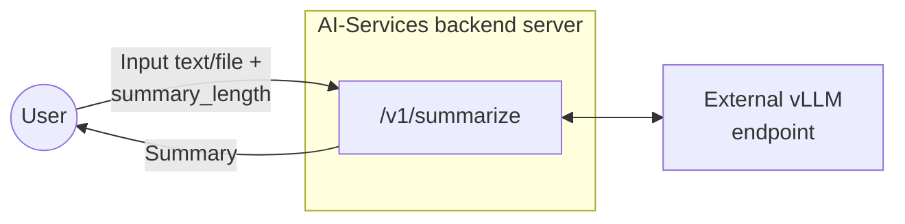
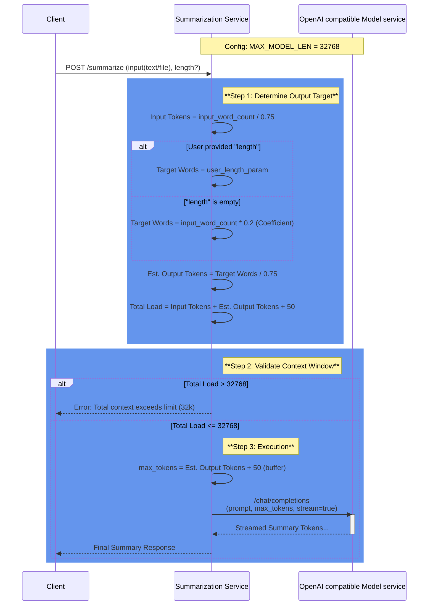

# Summarization Endpoint Design Document

## 1. Overview

This document describes the design and implementation of a summarization endpoint for backend server of AI-Services. The endpoint accepts text content in multiple formats (plain text, .txt files, or .pdf files) and returns AI-generated summaries of configurable length.

## 2. Endpoint Specification

### 2.1 Endpoint Details

| Property | Value                                   |
|----------|-----------------------------------------|
| HTTP Method | POST                                    |
| Endpoint Path | /v1/summarize                           |
| Content Type | multipart/form-data or application/json |

### 2.2 Request Parameters

| Parameter | Type | Required    | Description                                                                                        |
|--------|------|-------------|----------------------------------------------------------------------------------------------------|
| text | string | Conditional | Plain text content to summarize. Required if file is not provided.                                 |
| file | file | Conditional | File upload (.txt or .pdf). Required if text is not provided.                                      |
| length | integer | Conditional | Desired summary length in no. of words                                                             |
| stream | bool | Conditional | if true, stream the content value directly. Default value will be false if not explicitly provided |

### 2.3 Response Format

The endpoint returns a successful JSON response with the following structure:

| Field                  | Type | Description                                |
|------------------------|------|--------------------------------------------|
| data                   | object| Container for the response payload         |
| data.summary           | string | The generated summary text                 |
| data.original_length   | integer | Word count of original text                |
| data.summary_length    | integer | Word count of the generated summary        |
| meta                   | object | Metadata regarding the request processing. | 
| meta.model             | string | The AI model used for summarization        |
| meta.processing_time_ms | integer| Request processing time in milliseconds      |
| meta.input_type        |string| The type of input provided. Valid values: text, file.|
| usage                  | object | Token usage statistics for billing/quotas.|
| usage.input_tokens     | integer| Number of input tokens consumed.      |
| usage.output_tokens    | integer| Number of output tokens generated.        |
| usage.total_tokens     | integer| Total number of tokens used (input + output). |

Error response:

| Field         | Type | Description                     |
|---------------|------|---------------------------------|
| error         | object | Error response details
| error.code    | string | error code |
| error.message | string | error message |
| error.status  | integer | error status |
## 3. Architecture



## 4. Implementation Details

### 4.1 Environment Configuration

| Variable | Description | Example                                              |
|----------|-------------|------------------------------------------------------|
| OPENAI_BASE_URL | OpenAI-compatible API endpoint URL |  https://api.openai.com/v1   |
| MODEL_NAME | Model identifier | ibm-granite/granite-3.3-8b-instruct                  |
* Max file size for files will be decided as below, check 4.2.1

### 4.2.1 Max size of input text (only for English Language)

*Similar calculation will have to done for all languages to be supported

**Assumptions:**
- Context window for granite model on spyre in our current configuration is 32768 since MAX_MODEL_LEN=32768 when we run vllm.
- Token to word relationship for English: 1 token ≈ 0.75 words
- SUMMARIZATION_COEFFICIENT = 0.2. This would provide a 200-word summary from a 1000 word input. 
- (summary_length_in_words = input_length_in_words*DEFAULT_SUMMARIZATION_COEFFICIENT)

We need to account for:
- System prompt: ~30-50 tokens
- Output summary size: input_length_in_words*SUMMARIZATION_COEFFICIENT

**Calculations:**
- input_length_in_words/0.75 + 50 + (input_length_in_words/0.75)*SUMMARIZATION_COEFFICIENT < 32768
- => 1.6* input_length_in_words < 32718
- => input_length_in_words < 20449

- max_tokens calculation will also be made according to SUMMARIZATION_COEFFICIENT
- max_tokens = (input_length_in_words/0.75)*SUMMARIZATION_COEFFICIENT + 50 (buffer)

**Conclusion:** We can say that considering the above assumptions, our input tokens can be capped at 20.5k words. 
Initially we can keep the context length as configurable and let the file size be capped dynamically with above calculation.
This way we can handle future configurations and models with variable context length.

### 4.2.2 Sequence Diagram to explain above logic



### 4.2.3 Stretch goal: German language support
- Token to word relationship for German: 1 token ≈ 0.5 words
- Rest everything remains same

**Calculations:**
- input_length_in_words/0.5 + 50 + (input_length_in_words/0.5)*SUMMARIZATION_COEFFICIENT < 32768
- => 2.4* input_length_in_words < 32718
- => input_length_in_words < 13632

- max_tokens calculation will also be made according to SUMMARIZATION_COEFFICIENT
- max_tokens = (input_length_in_words/0.5)*SUMMARIZATION_COEFFICIENT + 50 (buffer)

### 4.3 Processing Logic

1. Validate that either text or file parameter is provided. If both are present, text will be prioritized.
2. Validate summary_length is smaller than the set upper limit.
3. If file is provided, validate file type (.txt or .pdf)
4. Extract text content based on input type. If file is pdf, use pypdfium2 to process and extract text.
5. Validate input text word count is smaller than the upper limit.
6. Build AI prompt with appropriate length constraints
7. Send request to AI endpoint
8. Parse AI response and format result
9. Return JSON response with summary and metadata

## 5. Rate Limiting

- Rate limiting for this endpoint will be done similar to how it's done for chatbot.app currently
- Since we want to support only upto 32 connections to the vLLM at any given time, `max_concurrent_requests=32`,
- Use `concurrency_limiter = BoundedSemaphore(max_concurrent_requests)` and acquire a lock on it whenever we are serving a request.
- As soon as the response is returned, release the lock and return the semaphore back to the pool.

## 6. Use Cases and Examples

### 6.1 Use Case 1: Plain Text Summarization

**Request:**
```
curl -X POST http://localhost:5000/v1/summarize \
-H "Content-Type: application/json" \
-d '{"text": "Artificial intelligence has made significant progress in recent years...", "length": 25}'
```
**Response:**
200 OK 
```json
{
  "data": {
    "summary": "AI has advanced significantly through deep learning and large language models, impacting healthcare, finance, and transportation with both opportunities and ethical challenges.",
    "original_length": 250,
    "summary_length": 22
  },
  "meta": {
    "model": "ibm-granite/granite-3.3-8b-instruct",
    "processing_time_ms": 1245,
    "input_type": "text"
  },
  "usage": {
    "input_tokens": 385,
    "output_tokens": 62,
    "total_tokens": 447
  }
}
```

---

### 6.2 Use Case 2: TXT File Summarization

**Request:**
```
curl -X POST http://localhost:5000/v1/summarize \
  -F "file=@report.txt" \
  -F "length=50"
```

**Response:**
200 OK 
```json
{
  "data": {
    "summary": "The quarterly financial report shows revenue growth of 15% year-over-year, driven primarily by increased cloud services adoption. Operating expenses remained stable while profit margins improved by 3 percentage points. The company projects continued growth in the next quarter based on strong customer retention and new product launches.",
    "original_length": 351,
    "summary_length": 47
  },
  "meta": {
    "model": "ibm-granite/granite-3.3-8b-instruct",
    "processing_time_ms": 1245,
    "input_type": "file"
  },
  "usage": {
    "input_tokens": 468,
    "output_tokens": 62,
    "total_tokens": 530
  }
}

```

---

### 6.3 Use Case 3: PDF File Summarization

**Request:**
```
curl -X POST http://localhost:5000/v1/summarize \
  -F "file=@research_paper.pdf" 
```

**Response:**
200 OK 
```json
{
  "data": {
    "summary": "This research paper investigates the application of transformer-based neural networks in natural language processing tasks. The study presents a novel architecture that combines self-attention mechanisms with convolutional layers to improve processing efficiency. Experimental results demonstrate a 12% improvement in accuracy on standard benchmarks compared to baseline models. The paper also analyzes computational complexity and shows that the proposed architecture reduces training time by 30% while maintaining comparable performance. The authors conclude that hybrid approaches combining different neural network architectures show promise for future NLP applications, particularly in resource-constrained environments.",
    "original_length": 982,
    "summary_length": 89
  },
  "meta": {
    "model": "ibm-granite/granite-3.3-8b-instruct",
    "processing_time_ms": 1450,
    "input_type": "file"
  },
  "usage": {
    "input_tokens": 1309,
    "output_tokens": 120,
    "total_tokens": 1429
  }
}
```
### 6.4 Use Case 4: streaming summary output

**Request:**
```
curl -X POST http://localhost:5000/v1/summarize \
  -F "file=@research_paper.pdf" \
  -F "stream=True"
```
**Response:**
202 Accepted 
```
data: {"id":"chatcmpl-c0f017cf3dfd4105a01fa271300049fa","object":"chat.completion.chunk","created":1770715601,"model":"ibm-granite/granite-3.3-8b-instruct","choices":[{"index":0,"delta":{"role":"assistant","content":""},"logprobs":null,"finish_reason":null}],"prompt_token_ids":null}

data: {"id":"chatcmpl-c0f017cf3dfd4105a01fa271300049fa","object":"chat.completion.chunk","created":1770715601,"model":"ibm-granite/granite-3.3-8b-instruct","choices":[{"index":0,"delta":{"content":"The"},"logprobs":null,"finish_reason":null,"token_ids":null}]}

data: {"id":"chatcmpl-c0f017cf3dfd4105a01fa271300049fa","object":"chat.completion.chunk","created":1770715601,"model":"ibm-granite/granite-3.3-8b-instruct","choices":[{"index":0,"delta":{"content":"quar"},"logprobs":null,"finish_reason":null,"token_ids":null}]}

data: {"id":"chatcmpl-c0f017cf3dfd4105a01fa271300049fa","object":"chat.completion.chunk","created":1770715601,"model":"ibm-granite/granite-3.3-8b-instruct","choices":[{"index":0,"delta":{"content":"ter"},"logprobs":null,"finish_reason":null,"token_ids":null}]}

```

### 6.5 Error Case 1: Unsupported file type

**Request:**
```
curl -X POST http://localhost:5000/v1/summarize \
  -F "file=@research_paper.md" 
```
**Response:**
400 
```json
{
  "error": {
    "code": "UNSUPPORTED_FILE_TYPE",
    "message": "Only .txt and .pdf files are allowed.",
    "status": 400}
}
```
## 7.1 Successful Responses

| Status Code | Scenario                     |
|-------------|------------------------------|
| 200 | plaintext in json body       |
|200| pdf file in multipart form data |
| 200 | txt file in multipart form data |
|202 | streaming enabled            |

## 7.2 Error Responses

| Status Code | Error Scenario | Response Example                                                           |
|-------------|----------------|----------------------------------------------------------------------------|
| 400 | Missing both text and file | {"message": "Either 'text' or 'file' parameter is required"}               |
| 400 | Unsupported file type | {"message": "Unsupported file type. Only .txt and .pdf files are allowed"} |
| 413 | File too large | {"message": "File size exceeds maximum token limit"}                       |
| 500 | AI endpoint error | {"message": "Failed to generate summary. Please try again later"}          |
| 503 | AI services unavailable | {"message": "Summarization service temporarily unavailable"}               |


## 8. Test Cases

| Test Case | Input | Expected Result |
|-----------|-------|-----------------|
| Valid plain text, short | text + length=50 | 200 OK with short summary |
| Valid .txt file, medium | .txt file + length=200 | 200 OK with medium summary |
| Valid .pdf file, long | .pdf file + length=500 | 200 OK with long summary |
| Missing parameters | No text or file | 400 Bad Request |
| Invalid file type | .docx file | 400 Bad Request |
| File too large | 15MB file | 413 Payload Too Large |
| Invalid summary_length | length="long" | 400 Bad Request |
| AI service timeout | Valid input + timeout | 500 Internal Server Error |

## 9. Summary Length Configuration Proposal for UI

1. Word count limit hiding behind understandable identifier words like – short, medium, long

| Length Option | Target Words | Instruction                                                     |
|---------------|--------------|-----------------------------------------------------------------|
| short         | 50-100       | Provide a brief summary in 2-3 sentences                        |
| medium        | 150-250      | Provide a comprehensive summary in 1-2 paragraphs               |
| long          | 300-500      | Provide a detailed summary covering all key points              |
| extra long    | 800-1000     | Provide a complete and detailed summary covering all key points |

====================================================================================================

ADDENDUM FOR ASYNC SUMMARIZATION JOBS
====================================================================================================

## 1. Overview

This document proposes adding **asynchronous job-based summarization** to the existing `/v1/summarize` service. The design mirrors the job lifecycle already implemented in the Digitize Documents service while adapting it to the summarization domain. Users will be able to submit files for background summarization, track progress via job endpoints, and retrieve results when complete.

The existing synchronous `POST /v1/summarize` endpoint remains unchanged. The new job-based flow is additive and operates through a separate set of endpoints under `/v1/summarize/jobs` and `/v1/summarize/results`.

---
## 2. Motivation

The current synchronous endpoint works well for short texts and small files, but has limitations for larger workloads:

- Long-running summarizations can time out on the client or reverse-proxy layer.
- Streaming mode partially addresses latency but still requires the client to hold a connection open.
- There is no persistent record of past summarization requests or results.

An async job model solves all of these while staying consistent with the patterns already established by the digitize service.

---
## 3. Non-Goals

- **Horizontal scaling:** Like the digitize service, the summarization job system is designed for single-replica deployment.
- **Replacing the sync endpoint:** `POST /v1/summarize` continues to work as-is for quick, interactive use cases.
- **Multi-file jobs:** Each job processes exactly one document. Clients that need to summarize multiple files should submit one job per file.

---

## 4. New Endpoints

| Method | Endpoint | Description |
|:---|:---|:---|
| **POST** | `/v1/summarize/jobs` | Submit a single file for async summarization. Returns a `job_id`. |
| **GET** | `/v1/summarize/jobs` | List all summarization jobs with pagination and filters. |
| **GET** | `/v1/summarize/jobs/{job_id}` | Get detailed status of a specific job. |
| **DELETE** | `/v1/summarize/jobs/{job_id}` | Delete a completed/failed job record and its associated document metadata and result. |
| **DELETE** | `/v1/summarize/jobs` | Bulk delete all jobs, document metadata, and results. Requires `confirm=true`. |
| **GET** | `/v1/summarize/results/{job_id}` | Retrieve the summarization result for a specific job. |

> **Design note — endpoint prefix:** The digitize service uses `/v1/jobs` and `/v1/documents` because it is a standalone microservice on its own port (4000). 
> The summarization service shares a port with its existing `/v1/summarize` endpoint, so the job endpoints are nested under `/v1/summarize/jobs` and results under `/v1/summarize/results` to avoid collisions and keep the API self-descriptive.

---
## 5. Endpoint Specifications

### 5.1 POST /v1/summarize/jobs — Create Summarization Job

**Content-Type:** `multipart/form-data`

**Form parameters:**

| Parameter | Type | Required | Description |
|:---|:---|:---|:---|
| `file` | file | Yes | A single `.txt` or `.pdf` file to summarize. |
| `length` | integer | No | Desired summary length in words. |
| `job_name` | string | No | Optional human-readable label for the job. |

**Validation rules:**

- Exactly one file must be provided.
- The file must have a `.txt` or `.pdf` extension.
- The file's word count must be within the `MAX_INPUT_WORDS` limit (same validation as the sync endpoint).
- If `length` is provided, it must be a positive integer within bounds.

**Processing flow:**

1. Validate the file and parameters.
2. Check the `concurrency_limiter` semaphore. If all 32 slots are occupied, return `429`.
3. Generate a `job_id` (UUID) and a `doc_id` (UUID) for the file.
4. Stage the uploaded file to `/var/cache/summarize/staging/{job_id}/`.
5. Write `{job_id}_status.json` to `/var/cache/summarize/jobs/` with initial status `accepted`.
6. Write `{doc_id}_metadata.json` to `/var/cache/summarize/docs/`.
7. Acquire the semaphore and launch background processing via FastAPI `BackgroundTasks`.
8. Return `202 Accepted` with `{ "job_id": "..." }`.

**Background worker:**

1. Read the staged file and extract text (PDF via `pypdfium2`, TXT via UTF-8 decode).
2. Update job status to `in_progress`, document status to `in_progress`.
3. Validate word count and compute `target_words` / `max_tokens`.
4. Build prompt and call `query_vllm_summarize`.
5. Trim the result to the last complete sentence.
6. Write the result to `/var/cache/summarize/results/{job_id}_result.json`.
7. Update document status to `completed` (or `failed` on error).
8. Update job status to `completed` (or `failed` on error).
9. Clean up staging directory.
10. Release the semaphore.

**Response codes:**

| Status | Description |
|:---|:---|
| 202 Accepted | Job created successfully. |
| 400 Bad Request | Missing file, multiple files provided, or invalid `length`. |
| 415 Unsupported Media Type | File is not a valid `.txt` or `.pdf`. |
| 429 Too Many Requests | Semaphore at capacity. |
| 500 Internal Server Error | Unexpected failure. |

**Sample request:**

```bash
curl -X POST http://localhost:6000/v1/summarize/jobs \
  -F "file=@report.pdf" \
  -F "length=200"
```

**Sample response (202):**

```json
{
    "job_id": "a1b2c3d4-e5f6-7890-abcd-ef1234567890"
}
```
---
### 5.2 GET /v1/summarize/jobs — List All Jobs

**Query parameters:**

| Parameter | Type | Required | Description |
|:---|:---|:---|:---|
| `latest` | bool | No | Return only the most recent job. Default: `false`. |
| `limit` | int | No | Records per page (1–100). Default: `20`. |
| `offset` | int | No | Records to skip. Default: `0`. |
| `status` | string | No | Filter by status: `accepted`, `in_progress`, `completed`, `failed`. |

**Response codes:**

| Status | Description                    |
|:---|:-------------------------------|
| 200 OK | Paginated job list.            |
| 400 Bad Request | Invalid values of query params |
| 500 Internal Server Error | Failure reading job files.     |

**Sample request:**

```bash
curl  http://localhost:6000/v1/summarize/jobs 
```

**Sample response (200):**

```json
{
    "pagination": {
        "total": 1,
        "limit": 20,
        "offset": 0
    },
    "data": [
        {
            "job_id": "a1b2c3d4-e5f6-7890-abcd-ef1234567890",
            "job_name": "Q3 revenue report",
            "status": "completed",
            "submitted_at": "2026-03-15T10:30:00Z",
            "completed_at": "2026-03-15T10:31:45Z"
        }
    ]
}
```
---
### 5.3 GET /v1/summarize/jobs/{job_id} — Get Job Details

Returns full status of a specific job including its document status.

**Response codes:**

| Status | Description |
|:---|:---|
| 200 OK | Job details. |
| 404 Not Found | No job with this ID. |
| 500 Internal Server Error | Failure reading job file. |

**Sample response (200):**

```json
{
    "job_id": "a1b2c3d4-e5f6-7890-abcd-ef1234567890",
    "job_name": "Q3 revenue report",
    "status": "completed",
    "submitted_at": "2026-03-15T10:30:00Z",
    "completed_at": "2026-03-15T10:31:45Z",
    "document": {
        "id": "d1e2f3a4-b5c6-7890-abcd-ef1234567890",
        "name": "report1.pdf",
        "status": "completed"
    },
    "error": null
}
```
---
### 5.4 DELETE /v1/summarize/jobs/{job_id} — Delete Job Record

Deletes the job status file, the associated document metadata file, and the result file. Only `completed` or `failed` jobs may be deleted.

**Response codes:**

| Status | Description |
|:---|:---|
| 204 No Content | Job and associated data deleted. |
| 404 Not Found | No job with this ID. |
| 409 Conflict | Job is still active (`accepted` or `in_progress`). |
| 500 Internal Server Error | Unexpected failure. |

---

### 5.5 DELETE /v1/summarize/jobs — Bulk Delete All Jobs

Deletes **all** job status files, document metadata files, result files, and any remaining staging data. This is the summarization equivalent of the digitize service's bulk document delete.

**Query parameters:**

| Parameter | Type | Required | Description |
|:---|:---|:---|:---|
| `confirm` | bool | Yes | Must be `true` to proceed with bulk deletion. |

**Processing flow:**

1. Validate that `confirm=true`.
2. Check for active jobs. If any job has status `accepted` or `in_progress`, reject with `409`.
3. Delete all files under `/var/cache/summarize/jobs/`.
4. Delete all files under `/var/cache/summarize/docs/`.
5. Delete all files under `/var/cache/summarize/results/`.
6. Delete any remaining staging directories under `/var/cache/summarize/staging/`.
7. Return `204 No Content`.

**Response codes:**

| Status | Description |
|:---|:---|
| 204 No Content | Full cleanup completed. |
| 400 Bad Request | `confirm` is missing or not `true`. |
| 409 Conflict | An active job exists (`accepted` or `in_progress`). |
| 500 Internal Server Error | Failure during deletion. |

**Sample request:**

```bash
curl -X DELETE 'http://localhost:6000/v1/summarize/jobs?confirm=true'
```
---
### 5.6 GET /v1/summarize/results/{job_id} — Get Summarization Result

Returns the completed summary and result metadata for the document associated with a specific job.

**Response codes:**

| Status | Description |
|:---|:---|
| 200 OK | Summary result. |
| 202 Accepted | Summarization is still in progress. |
| 404 Not Found | No job with this ID or result not available. |
| 500 Internal Server Error | Failure reading result file. |

**Sample response (200):**

```json
{
    "data": {
        "summary": "The quarterly report shows 15% revenue growth driven by cloud adoption...",
        "original_length": 4200,
        "summary_length": 180
    },
    "meta": {
        "model": "ibm-granite/granite-3.3-8b-instruct",
        "processing_time_ms": 3420,
        "input_type": "file"
    },
    "usage": {
        "input_tokens": 5600,
        "output_tokens": 240,
        "total_tokens": 5840
    }
}
```

---
## 6. Storage Layout

All job-related state is persisted under `/var/cache/summarize/`, which is a persistent volume mounted by the container runtime.

```
/var/cache/summarize/
├── staging/
│   └── {job_id}/
│       └── report.pdf
├── jobs/
│   └── {job_id}_status.json
├── docs/
│   └── {doc_id}_metadata.json
└── results/
    └── {job_id}_result.json
```

### 6.1 Job Status File — `{job_id}_status.json`

```json
{
    "job_id": "a1b2c3d4-...",
    "job_name": "Q3 revenue report",
    "operation": "summarization",
    "status": "completed",
    "submitted_at": "2026-03-15T10:30:00Z",
    "completed_at": "2026-03-15T10:31:45Z",
    "summary_length": 200,
    "document": {
        "id": "d1e2f3a4-...",
        "name": "report1.pdf",
        "status": "completed"
    },
    "error": null
}
```

### 6.2 Document Metadata File — `{doc_id}_metadata.json`

```json
{
    "id": "d1e2f3a4-...",
    "name": "report1.pdf",
    "type": "summarization",
    "status": "completed",
    "submitted_at": "2026-03-15T10:30:00Z",
    "completed_at": "2026-03-15T10:31:12Z",
    "job_id": "a1b2c3d4-...",
    "error": null,
    "metadata": {
        "original_word_count": 4200,
        "summary_word_count": 180,
        "processing_time_ms": 3420
    }
}
```

### 6.3 Result File — `{job_id}_result.json`

```json
{
    "data": {
        "summary": "The quarterly report shows...",
        "original_length": 4200,
        "summary_length": 180
    },
    "meta": {
        "model": "ibm-granite/granite-3.3-8b-instruct",
        "processing_time_ms": 3420,
        "input_type": "file"
    },
    "usage": {
        "input_tokens": 5600,
        "output_tokens": 240,
        "total_tokens": 5840
    }
}
```

---

## 7. Concurrency Limiting

Both the synchronous `POST /v1/summarize` endpoint and the async job background worker share a **single** `BoundedSemaphore` that limits total concurrent vLLM connections to 32, matching the existing design:

```python
concurrency_limiter = asyncio.BoundedSemaphore(settings.max_concurrent_requests)  # default: 32
```

The sync endpoint already acquires this semaphore before calling vLLM (either via `async with concurrency_limiter` for non-streaming or explicit `acquire`/`release` for streaming). The async job background worker follows the same pattern — it acquires the semaphore before its LLM call and releases it afterward.

**Behavior:**

- The semaphore is checked with `concurrency_limiter.locked()` at request time. If all 32 slots are occupied (by any mix of sync requests and async job workers), the incoming request is rejected with `429`.
- For the `POST /v1/summarize/jobs` endpoint, the semaphore is acquired before launching the background task. The worker holds the slot for the duration of its single LLM call and releases it once the response is received and the result is written. This means an async job consumes exactly one of the 32 slots while it is actively calling vLLM, leaving the remaining slots available for sync requests.
- There is no separate job-level semaphore. The shared semaphore is sufficient because each job processes a single document with a single LLM call, so it behaves identically to a sync request from the vLLM connection perspective.

---

## 8. Recovery Strategy

Identical to the digitize service:

1. **Boot-up scan:** On startup, the FastAPI app scans `/var/cache/summarize/jobs/*.json`.
2. **Identify zombies:** Any job with status `accepted` or `in_progress` is a zombie (no worker is handling it after a restart).
3. **Mark as failed:** Update those jobs to `status: failed` with error `"System restarted during processing"`.
4. **Cleanup:** Delete corresponding staging directories under `/var/cache/summarize/staging/`.

---

## 9. Test Cases

| Test Case | Input | Expected Result |
|:---|:---|:---|
| Submit single PDF | 1 PDF file | 202 with job_id, eventually completes |
| Submit single TXT | 1 TXT file | 202 with job_id, eventually completes |
| Submit multiple files | 2 files in one request | 400 `INVALID_REQUEST` |
| No file attached | Empty request | 400 `INVALID_REQUEST` |
| Unsupported file type | `.docx` file | 400 `UNSUPPORTED_FILE_TYPE` |
| File exceeds word limit | Very large PDF | 413 `CONTEXT_LIMIT_EXCEEDED` |
| Corrupt PDF | Invalid bytes with `.pdf` ext | 415 `UNSUPPORTED_MEDIA_TYPE` |
| Semaphore exhausted | Submit while another job runs | 429 `RATE_LIMIT_EXCEEDED` |
| Get job status | Valid `job_id` | 200 with current status and document info |
| Get nonexistent job | Random UUID | 404 `RESOURCE_NOT_FOUND` |
| Delete completed job | Completed `job_id` | 204 No Content |
| Delete active job | In-progress `job_id` | 409 `RESOURCE_LOCKED` |
| Bulk delete (confirm=true) | No active jobs | 204 No Content, all data removed |
| Bulk delete (confirm=false) | `confirm=false` | 400 `INVALID_REQUEST` |
| Bulk delete (active job) | An in-progress job exists | 409 `RESOURCE_LOCKED` |
| Get result | Completed `job_id` | 200 with summary data |
| Get result (in progress) | In-progress `job_id` | 202 Accepted |
| Get result (not found) | Random UUID | 404 `RESOURCE_NOT_FOUND` |
| Recovery after crash | Kill during processing | On restart, zombie jobs marked `failed` |

---